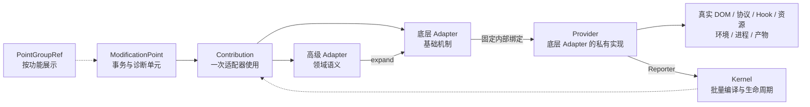

# OpenCodex 虚拟修改骨架：架构与开发指南

**中文** | [English](MODIFICATION_SKELETON_EN.md)

本文是虚拟修改骨架的规范文档，供维护者理解架构并新增内置修改点。插件 manifest、目录和构建方式见 [插件 v2](./PLUGINS.md)。

本文只使用一套术语和一条新增流程。浏览器、Gateway、静态转换器和 Runner 只是代码运行的物理上下文，不是修改点的第三种分类。

示例中的 `ThreadMessageActions`、`RuntimeViewAdapter` 等名称代表对应 Adapter 模块导出的强类型对象；新增代码应引用真实对象，不按这些名称或 ID 字符串进行运行时查找。

## 1. 核心模型



每个概念只回答一个问题：

| 概念 | 回答的问题 | 明确不负责什么 |
|---|---|---|
| PointGroupRef | 开发者在调试页怎样按功能查看？ | 不决定启停、依赖、回退、运行位置或执行方式 |
| ModificationPoint | 哪个行为作为一个原子事务和诊断单元？ | 不接触真实对象，不完成底层定位 |
| 高级 Adapter | 领域行为应展开为哪些更基础的能力？ | 不访问 DOM、Node、Electron 或资源正文 |
| 底层 Adapter | 使用哪一种通用修改机制？ | 不按功能分类，不暴露真实平台对象 |
| Provider | 该底层机制怎样操作真实对象？ | 不对修改点公开，不参与功能分类 |
| Runtime Context | 哪个物理进程或构建阶段执行这批修改点？ | 不是修改点字段，不从 ID 推断 |
| Kernel | 如何批量编译、执行、回滚、销毁和记录状态？ | 不决定业务策略，不搜索 Provider |

必须遵守：

- 修改点 ID 只用于稳定命名、日志、持久化和跨进程序列化。
- ID 前缀不决定运行位置、适配器或 Provider。
- 修改点只引用强类型 Group、Adapter、Signal、Capability、Target、Locator、Slot 和 Schema 对象。
- 高级和底层 Adapter 都允许修改点直接使用；优先使用语义最精确的高级 Adapter。
- 高级 Adapter 通过 Expander 决定依赖哪些 Adapter。
- 每个底层 Adapter 在一个 Runtime 中固定绑定一个内部 Provider。
- Kernel 只根据 AdapterRef 对象身份调用已经建立的绑定，不按名称寻找实现。
- 安装完成只代表 ready；真实业务效果发生后才代表 active。

## 2. 核心对象

### 2.1 PointGroupRef：纯展示分类

分类组用于按领域组织修改点：

```ts
const TokenUsageGroup = definePointGroup({
  id: "token-usage",
  name: "Token 用量",
  description: "提取并展示线程 Token 使用情况。",
  order: 70,
});
```

分类组不得包含 `required`、`optional`、`fallback`、`enabled` 或 `canActivate` 等运行语义。组状态只由成员状态派生，供调试页展示；总体状态和统计只计算修改点。

### 2.2 ModificationPoint：原子事务边界

修改点包含：

- 稳定 ID、说明和 owner；
- 一个 PointGroupRef；
- 一个或多个 Adapter Contribution。

同一修改点的多个直接 Contribution 默认原子执行。任何一个 Contribution 在应用、验证或激活阶段失败，Kernel 会逆序清理和回滚这个修改点已经尝试的 Contribution。

因此：

- 必须一起成功或一起失败的行为放在同一个修改点。
- 能够独立失败、独立关闭或独立诊断的行为拆成不同修改点。
- “提取 Token 数据”和“挂载 Token 徽标”应是两个修改点。

### 2.3 Contribution：修改点使用 Adapter 的结果

`AdapterRef.use(declaration)` 返回 AdapterUse，也就是 Contribution：

```ts
const point = defineModificationPoint({
  id: "example.message-action",
  description: "在消息操作区增加示例操作",
  owner: "web-shell",
  group: RendererUiGroup,
  contributions: [
    MessageActionsAdapter.use({
      action: ExampleAction,
    }),
  ],
});
```

直接 Adapter 是修改点注册时使用的 Adapter。高级 Adapter 展开后经过的全部 Adapter 构成完整依赖链。

### 2.4 Adapter：强类型能力契约

Adapter 分为：

- `composite`：高级 Adapter，表达领域语义并通过 Expander 展开。
- `terminal`：底层 Adapter，表达一种基础修改机制。

依赖只能传 AdapterRef 对象：

```ts
const ThreadMessageActions = defineAdapter<ThreadMessageActionsDeclaration>({
  id: "adapter.thread-message-actions",
  name: "线程消息操作区",
  description: "提供消息操作区的稳定语义挂载槽。",
  kind: "composite",
  dependencies: [SemanticViewAdapter],
});
```

高级 Adapter 可以根据强类型声明选择依赖中的一个或多个 Adapter，但不能接触真实环境。

### 2.5 Provider：底层 Adapter 的私有实现

Provider 才能接触真实 DOM、协议连接、函数对象、Electron、Node、文件系统、资源正文或签名工具。

Adapter 和 Provider 分开，是为了让修改点工程保持环境无关：Adapter 契约可以在不包含 DOM/Node 类型的严格工程中使用，Provider 留在 internal 平台模块中。

两者不是多选关系：

```text
RuntimeViewAdapter
    └─ 当前 Runtime 中固定绑定 RuntimeViewProvider

RuntimeHookAdapter
    └─ 当前 Runtime 中固定绑定 RuntimeHookProvider
```

由底层 Adapter 的 internal 模块确定并创建它的 Provider；Runtime 只提供当前平台能力并安装这份绑定，不参与实现选择。若 Adapter 需要根据平台能力构造不同内部策略，应在它自己的 Provider 工厂中完成。

`runtime.provide(provider)` 使用 `provider.adapter` 的 AdapterRef 对象身份建立一次绑定。同一 Runtime 中重复绑定会失败。Kernel 读取这份确定的绑定只是内部派发，不是搜索、推断或策略选择。

如果存在多种行为：

- 不同领域机制：由高级 Adapter 展开为不同底层 Adapter。
- 同一底层机制的不同平台策略：由这个底层 Adapter 唯一绑定的 Provider 在内部处理。

Provider 的批量接口：

```ts
interface TerminalAdapterProvider<TDeclaration> {
  readonly adapter: AdapterRef<TDeclaration>;
  compile(
    contributions: readonly BoundContribution<TDeclaration>[],
  ): CompiledAdapterPlan;
}
```

`compile()` 一次收到同类 Adapter 的完整批次，因此 Provider 可以合并定位、Observer、Listener、协议解析和函数 Wrapper。

### 2.6 Runtime Context：物理执行上下文

浏览器页面、Gateway 进程、静态资源转换器和 Runner 构建器是不同的 Runtime Context。

每个 Runtime Context 只负责：

- 显式注册本次要执行的修改点对象；
- 安装所需底层 Adapter 的内部 Provider 绑定；
- 创建、激活和销毁 Kernel；
- 提供真实平台能力及其生命周期。

Runtime Context 不写入 ModificationPoint，也不从修改点 ID 推断。一个修改点在哪里执行，只由哪个 Runtime 入口注册了这个修改点对象决定。

### 2.7 SignalRef 与 CapabilityRef

SignalRef<T> 表示 Adapter 之间的强类型数据流，例如协议 Adapter 发布 Token 数据，视图 Adapter 消费数据。

CapabilityRef<T> 表示 Adapter 产生的强类型能力，例如 ArtifactBuild 发布已经完成的 Runner 产物。

它们不通过字符串查找，也不会把真实平台对象泄漏给修改点。

### 2.8 Kernel：批量编译与统一生命周期

Kernel 负责：

- 注册并校验 Group、Adapter、Expander 和 Point 对象；
- 检查重复 ID、无效引用和 Adapter 依赖环；
- 展开高级 Adapter；
- 按终端 AdapterRef 聚合 Contribution；
- 调用已经固定绑定的 Provider 批量编译；
- 按修改点执行原子应用、验证、激活和逆序回滚；
- 管理 disposer、引用计数和 Runtime 销毁；
- 聚合状态、命中次数和只读性能诊断。

Kernel 不解释选择器、模块路径、文件路径或业务数据。

## 3. 编译、激活与状态

### 3.1 注册和编译

每个 Runtime 的启动顺序：

```text
注册 Group / Adapter / Expander
            ↓
显式注册当前 Runtime 的 Point 对象
            ↓
安装底层 Adapter → Provider 固定绑定
            ↓
compile
            ↓
activate
```

compile 过程：

1. 校验所有对象引用和依赖图。
2. 递归展开高级 Adapter。
3. 为每个终端叶子创建 BoundContribution。
4. 记录直接 Adapter、终端 Adapter 和完整依赖链。
5. 按终端 AdapterRef 对象批量聚合。
6. 调用该 Adapter 已绑定 Provider 的 `compile(batch)`。

compile 只生成计划，不产生业务效果。

### 3.2 定位到真实命中

```text
按底层 Adapter 批量 locate
            ↓
按 Point 原子 apply 全部 Contribution
            ↓
按 Point verify 全部 Contribution
            ↓
按 Point activate 全部 Contribution
            ↓
ready：实现已就绪
            ↓
真实业务路径发生
            ↓
active：Provider 报告真实命中
```

Provider 必须明确报告每个 Contribution 的定位结果。漏报不能被当成已定位。

修改点和高级 Adapter 不调用 Reporter。只有底层 Provider 能报告：

- resolving / resolved / unsupported / ambiguous / stale；
- applying / applied / rolledBack；
- verified / verificationNotRequired；
- hit / fallback / disabled / failed。

这样可以避免修改点在安装时提前误报“已命中”。

### 3.3 五阶段状态

| 阶段 | 含义 | 典型状态 |
|---|---|---|
| location | 是否找到唯一且仍有效的真实目标？ | unresolved、resolving、resolved、unsupported、ambiguous、stale、failed |
| application | 修改事务是否已经应用？ | pending、applying、applied、rolled-back、disabled、failed |
| verification | 应用结果是否满足不变量？ | pending、verified、not-required、failed |
| activation | 监听、回调和生命周期是否就绪？ | inactive、activating、ready、disposed、failed |
| exercise | 真实语义效果是否发生？ | not-exercised、active、disabled |

`activation: ready` 只表示实现已经安装。`exercise: active` 才表示真实业务效果发生。

### 3.4 修改点聚合状态

| 状态 | 含义 |
|---|---|
| pending | 仍在等待必要阶段，或者 Runtime 已销毁 |
| unavailable | 必要 Contribution 定位、应用、验证或激活失败 |
| degraded | 修改失败，但已经明确切换到官方行为或其他回退 |
| disabled | 当前配置或平台主动关闭 |
| ready | 已安装并通过验证，但尚未全部真实命中 |
| active | 所有直接 Contribution 的真实语义效果都已命中 |

同一修改点的多个直接 Contribution 必须全部真实命中后，修改点才显示 active。

## 4. 底层 Adapter 与选择规则

### 4.1 七类底层 Adapter

| Adapter | Provider 接触的真实能力 | 基础机制 |
|---|---|---|
| RuntimeView | DOM、布局与浏览器事件 | 定位、观察、虚拟节点、挂载、测量和清理 |
| ProtocolPipeline | IPC、WebSocket、NDJSON 等传输 | Schema 校验、观察、转换、路由和发布 |
| RuntimeHook | 函数、构造器、对象属性和模块导出 | before、after、around 和共享 Wrapper |
| StaticResource | HTML、JavaScript、文本或二进制资源 | 定位、事务转换和输出验证 |
| RuntimeEnvironment | 环境变量、启动参数和全局能力 | 提交边界、覆盖和恢复 |
| ProcessInterception | 子进程和系统打开行为 | 有序拦截链和调用装饰 |
| ArtifactBuild | 暂存区、ASAR、签名工具和产物目录 | 组装、校验和原子提交 |

标准 Declaration 和强类型 Ref 构造器位于 `gateway/src/modification/contracts.ts`。

### 4.2 选择顺序

1. 已有高级 Adapter 能准确表达需求时，使用高级 Adapter。
2. 没有对应高级 Adapter 时，先判断是否存在稳定的领域语义或后续复用可能；通常更推荐先新增高级 Adapter。
3. 只有一次性、实验性，或者确实没有可复用领域语义时，才直接使用底层 Adapter。
4. 多种机制必须原子成功时，在同一个修改点中使用多个 Contribution。
5. 七类基础机制都无法表达时，才新增底层 Adapter 及其内部 Provider。

所有公开的高级和底层 Adapter 都允许修改点使用。高级 Adapter 只是更推荐、更精确、更方便。

不需要等到第二个修改点出现才抽象：只要目标、槽位、协议消息或官方 API 已经形成清晰稳定的领域概念，就可以在第一次使用时建立高级 Adapter。最迟在相同底层声明第二次出现前完成提取。

不要为了调试页分类新增 Adapter；展示分类属于 PointGroup。

## 5. 新增内置修改点

### 5.1 先划定修改点边界

新增前明确：

- 哪个可观察结果代表真实命中；
- 哪些行为必须原子成功；
- 失败时是 unavailable，还是有明确 fallback；
- 关闭、重载或进程退出时需要释放什么；
- 必须保持哪些参数、返回值、异常、缓存、节流和事件顺序。

新增骨架接入时不得顺便修改业务算法。

### 5.2 选择功能组

优先引用已有 PointGroupRef：

```ts
group: POINT_GROUPS.tokenUsage
```

只有出现新的开发者查看领域时才注册新组。分类组名称、说明和顺序只影响调试页展示。

### 5.3 优先使用高级 Adapter

假设已经存在“线程消息操作区”高级 Adapter：

```ts
export const TokenUsageInlinePoint = defineModificationPoint({
  id: "web.runtime.dom.token-usage-inline",
  description: "在线程消息操作区展示 Token 用量",
  owner: "web-shell",
  group: POINT_GROUPS.tokenUsage,
  contributions: [
    ThreadMessageActions.afterFork.mount({
      source: TurnTokenUsage,
      content: TokenUsageBadge,
    }),
  ],
});
```

修改点只声明：

- 使用哪个语义槽；
- 数据来自哪个 Signal；
- 挂载什么虚拟内容。

它不知道选择器、MutationObserver、真实 Element 或插入算法。ThreadMessageActions 负责展开为 RuntimeView 声明，RuntimeViewProvider 负责真实定位和挂载。

### 5.4 没有对应高级 Adapter 时优先补充语义封装

“没有现成高级 Adapter”不等于“应该直接使用底层 Adapter”。先检查是否满足任一条件：

- 目标、槽位、协议消息或官方 API 具有稳定领域名称；
- 底层声明包含以后可能重复的 Locator、Target、Slot、Schema 或组合顺序；
- 后续修改点或插件可能复用同一能力；
- 可以通过统一语义进一步合并定位、监听、解析或 Hook。

满足任一条件时，优先按第 6 章新增高级 Adapter，再让修改点使用高级 Adapter。这样第一次接入就建立稳定复用边界，后续修改点只需要传入少量领域参数。

只有以下情况适合直接使用底层 Adapter：

- 一次性或实验性修改，语义尚未稳定；
- 底层 Adapter 的标准声明已经完整表达需求，没有额外领域规则；
- 确认不会复制 Locator、Slot、Schema、Target 或组合逻辑。

确实直接使用底层 Adapter 时，仍必须通过强类型 Ref 描述目标：

```ts
interface MessageActionsModel {
  readonly turnId: string;
}

interface ExperimentalBadgeData {
  readonly label: string;
  readonly tone: string;
}

const MessageActionsLocator =
  defineViewLocator<MessageActionsModel>("locator.thread-message-actions");
const AfterForkPlacement =
  defineViewPlacement("placement.thread-message-actions.after-fork");
const ExperimentalBadgeState =
  defineSignal<ExperimentalBadgeData>("signal.experimental-badge-state");
const RuntimeView = createRuntimeViewApi(RuntimeViewAdapter);

export const ExperimentalBadgePoint = defineModificationPoint({
  id: "web.runtime.dom.experimental-badge",
  description: "在消息操作区展示实验标记",
  owner: "web-shell",
  group: POINT_GROUPS.rendererUi,
  contributions: [
    RuntimeView.mountLowLevel({
      locator: MessageActionsLocator,
      placement: AfterForkPlacement,
      source: ExperimentalBadgeState,
      render({ data, ui }) {
        // 这里只创建虚拟节点，不接触真实 DOM。
        return ui.badge({ tone: data.tone }, [ui.text(data.label)]);
      },
    }),
  ],
});
```

Locator 和 Placement 的真实解析规则由 RuntimeViewProvider 私有注册，修改点只持有对象引用。

一旦第二个修改点需要复用相同 Locator、Placement 或挂载规则，应立即把它们提取到高级 Adapter，已有修改点也一并切换到该高级 Adapter。

### 5.5 多个 Contribution 的原子修改点

只有确实需要一起成功时才放在同一个修改点：

```ts
const point = defineModificationPoint({
  id: "example.protocol-and-view",
  description: "原子安装协议转换与配套视图",
  owner: "example",
  group: ExampleGroup,
  contributions: [
    SemanticProtocol.observe(protocolDeclaration),
    SemanticView.mount(viewDeclaration),
  ],
});
```

如果两者可以独立失败或独立诊断，应拆成两个修改点，并通过 SignalRef 连接。

### 5.6 显式注册到 Runtime

修改点定义完成后，由实际执行它的 Runtime 入口注册对象：

```ts
browserRuntime.registerPoint(TokenUsageProtocolPoint);
browserRuntime.registerPoint(TokenUsageInlinePoint);
```

这里传的是 ModificationPointDefinition 对象，不是字符串 ID。分类组和 Adapter 应已注册到同一个 Runtime；这个对象注册入口决定物理运行位置。

禁止：

```ts
// 错误：不能从 ID 前缀决定运行位置。
const runtime = runtimeForId(point.id);

// 错误：不能按字符串重新查找修改点。
registerPointById("web.runtime.dom.token-usage-inline");
```

### 5.7 普通新增点不新增 Provider

如果新修改点只使用已有 Adapter：

- 不新增 Provider；
- 不让 Kernel 选择 Provider；
- 不安装自己的全局 Observer、Listener 或 Hook；
- 不手工上报 resolved、applied、verified 或 hit；
- 不直接读取真实 DOM、协议连接、模块或文件。

底层 Adapter 已绑定的 Provider 会批量处理新 Contribution。

只有新增了全新的底层 Adapter，才需要实现和绑定新的 Provider。

### 5.8 各运行上下文的声明方式

| 运行上下文 | 修改点应声明什么 | Provider 隐藏什么 |
|---|---|---|
| Browser | 语义视图、Locator Ref、Slot、虚拟节点、协议 Schema、Hook Target | DOM 扫描、Observer、Listener、真实节点和 Wrapper |
| Gateway | 协议 Schema、Hook Target、Environment Key、Process Target | IPC/NDJSON、Electron、Node、进程和启动边界 |
| Static | Resource Target、语义 Locator、候选约束和输出不变量 | 原始资源读取、解码、事务修改、压缩和缓存 |
| Runner | Artifact Target、构建 Spec 和 Capability | 暂存、复制、ASAR、签名、校验和原子提交 |

修改点不能把真实平台对象作为 Adapter 声明参数。

### 5.9 添加直接行为测试

每个新修改点至少有一个真实行为测试：

- RuntimeView：虚拟结果、重挂载、清理和命中。
- ProtocolPipeline：Schema 匹配、非目标帧、转换和发布。
- RuntimeHook：this、参数、返回值、Promise 身份、异常和顺序。
- StaticResource：命中输出、未命中逐字节一致、候选歧义和验证。
- ArtifactBuild：产物结构、失败清理、签名和原子提交。

同时更新点数、运行上下文注册覆盖、调试报告和完整 Adapter 链断言。

## 6. 新增高级 Adapter

当缺少对应高级语义且领域边界已经稳定、预计会被复用，或者底层定位与组合规则已经重复时，新增 composite Adapter。通常推荐在第一次明确识别出稳定语义时就完成抽象。

### 6.1 定义强类型领域声明

```ts
interface MessageActionMountDeclaration {
  readonly source: SignalRef<unknown>;
  readonly render: (
    context: ViewRenderContext<unknown, MessageActionsModel>,
  ) => VirtualView;
}
```

声明只包含领域参数，不包含 CSS selector、Element、WebSocket 或模块对象。

### 6.2 声明依赖并实现 Expander

```ts
const MessageActionsAdapter =
  defineAdapter<MessageActionMountDeclaration>({
    id: "adapter.message-actions",
    name: "消息操作区",
    description: "把消息操作语义展开为稳定视图挂载。",
    kind: "composite",
    dependencies: [RuntimeViewAdapter],
  });

const RuntimeView = createRuntimeViewApi(RuntimeViewAdapter);

runtime.expand({
  adapter: MessageActionsAdapter,
  expand(declaration) {
    return [
      RuntimeView.mount({
        target: ThreadMessageActionsTarget,
        slot: AfterForkSlot,
        source: declaration.source,
        render: declaration.render,
      }),
    ];
  },
});
```

Expander：

- 只能使用 dependencies 中声明的 AdapterRef；
- 可以根据声明选择依赖中的不同 Adapter；
- 不能访问真实平台；
- 必须返回至少一个 AdapterUse；
- 必须有依赖链、错误引用和循环依赖测试。

高级 Adapter 必须提供真实语义抽象。只增加名称并原样透传声明没有价值；纯展示分类应使用 PointGroup。

## 7. 新增底层 Adapter 和 Provider

只有现有七类机制无法表达新的物理接入方式时才新增 terminal Adapter。

### 7.1 底层 Adapter 要求

- 环境无关的严格 Declaration；
- 带品牌的 Target、Locator、Schema、Signal 或 Capability Ref；
- 明确的批量键和共享资源策略；
- 明确的定位、应用、验证、激活、命中、回滚和销毁语义；
- 不向修改点导出 Provider 或真实平台对象。

### 7.2 Provider 骨架

```ts
const provider: TerminalAdapterProvider<MyDeclaration> = {
  adapter: MyTerminalAdapter,
  compile(contributions) {
    // 按目标合并扫描器、解析器、监听器或 Wrapper。
    const sharedPlan = compileSharedPlan(contributions);

    return {
      locate(reporter) {
        for (const contribution of contributions) {
          const target = sharedPlan.locate(contribution);
          if (target) reporter.resolved(contribution);
          else reporter.unsupported(contribution, "当前运行上下文不存在目标");
        }
      },
      apply(contribution, reporter) {
        sharedPlan.apply(contribution);
        reporter.applied(contribution);
      },
      verify(contribution, reporter) {
        if (!sharedPlan.verify(contribution)) {
          throw new Error("修改结果验证失败");
        }
        reporter.verified(contribution);
      },
      activate(contribution, reporter) {
        return sharedPlan.observeEffect(contribution, () => {
          // 真实语义效果发生后才报告命中。
          reporter.hit(contribution);
        });
      },
      rollback(contribution) {
        sharedPlan.rollback(contribution);
      },
      dispose() {
        sharedPlan.dispose();
      },
      diagnostics() {
        return sharedPlan.metrics();
      },
    };
  },
};
```

Runtime 初始化时执行一次：

```ts
runtime.provide(provider);
```

`provider.adapter` 是绑定键。重复绑定失败；Kernel 不按 ID、运行上下文名称或字符串策略查找 Provider。

### 7.3 性能要求

- 相同 DOM 定位只扫描一次。
- 每个观察根最多一个 MutationObserver。
- 相同事件源只安装一个 Listener。
- 每个协议帧只解码和校验一次。
- 每个函数目标只有一层 Wrapper。
- 每个静态资源缓存未命中只执行一次完整转换。
- 共享资源使用引用计数，最后一个 Contribution 销毁时才释放。
- diagnostics 只暴露非负数值计数器。

## 8. 外部插件

外部插件使用相同的 Group、Adapter、Point 和 Kernel 模型，但不能提供终端 Provider：

```ts
import type { OpenCodexPluginFactory } from "@opencodex/plugin-sdk";

export default ((sdk) => {
  const group = sdk.groups.register({
    id: "example.message-tools",
    name: "消息工具",
    description: "示例插件的开发者分类组。",
    order: 900,
  });

  const locator = sdk.view.locators.css(
    "locator.example-message-actions",
    '[data-app-action="message-actions"]',
  );

  sdk.points.register({
    id: "example.message-tools.hello",
    description: "在消息操作区追加文本",
    group,
    contributions: [sdk.adapters.semanticView.mount({
      locator,
      placement: sdk.view.placements.append,
      content: sdk.view.ui.text("Hello"),
    })],
  });
}) satisfies OpenCodexPluginFactory;
```

插件只看到冻结的 SDK 门面和公开 Adapter。Runtime 已经为这些底层 Adapter 固定绑定内部 Provider。

插件仍按可信代码运行；SDK 边界不是恶意代码安全沙箱。

## 9. 报告和调试

报告 Schema v2 包含：

- Group 名称、说明、顺序和成员；
- Adapter 名称、说明、terminal/composite 类型和依赖；
- Point 的 groupId、directAdapterIds 和 adapterChainIds；
- 每个终端 Contribution 的五阶段状态、命中次数和回退原因。

Kernel 本地快照还包含 providerDiagnostics。调试页总体状态和顶部统计只计算修改点；组状态只用于组头展示。

调试入口：

```text
/settings/developer/runtime-compatibility
/opencodex/runtime-compatibility
```

排查“已就绪但功能不可见”：

1. location 是否 resolved。
2. application 和 verification 是否成功。
3. activation 是否 ready。
4. exercise 是否 active，hitCount 是否增加。
5. Provider diagnostics 的扫描、解析或 Hook 计数是否变化。
6. 是否 disabled，或者失败后进入 fallback。

## 10. 仓库路径

| 路径 | 作用 |
|---|---|
| gateway/src/modification/sdk.ts | Group、Adapter、Point、Signal 和 Capability 对象 |
| gateway/src/modification/contracts.ts | 七类底层 Adapter 的标准 Declaration 和 Ref |
| gateway/src/modification/kernel.ts | 编译、事务、生命周期、Reporter 和状态 |
| gateway/src/modification/catalog.ts | 内置 Group、Adapter 和 Point 目录 |
| gateway/src/modification/production.ts | Gateway、静态和 Runner 的内部执行协调 |
| web-shell/src/modification-browser-host.ts | 浏览器 Adapter 绑定、共享资源和 Kernel 接入 |
| web-shell/src/plugin-sdk.ts | 外部 ESM v2 插件 SDK |

## 11. 实现对齐规则

以下内容不属于规范架构，新代码不得依赖：

- 从 `web.runtime.*`、`gateway.runtime.*` 或 `static.cache.*` 前缀推断运行位置；
- `HostForPointId`、`hostForPoint()` 或 `MIGRATION_MATRIX.host`；
- 在业务模块中按字符串重新查找修改点或 Adapter；
- 为同一个底层 Adapter 注册多个 Provider，再由 Kernel 动态挑选；
- 把受信功能脚本 key 当作 Adapter ID 或 Provider 选择条件；
- 修改点手工调用 Reporter 或在 installer 完成时上报 hit；
- 新修改点直接创建全局 Observer、Listener、Wrapper 或协议解析器。

这些结构如果仍存在，只能作为迁移兼容桥；它们不能出现在新增修改点的使用流程中，并应在实现对齐时删除。

## 12. 提交前检查

- [ ] PointGroup 只用于功能展示。
- [ ] 修改点没有 host/runtime 字段，ID 前缀没有运行语义。
- [ ] Runtime 入口通过对象引用显式注册修改点。
- [ ] 修改点优先使用高级 Adapter；没有现成封装时已先评估并优先补充可复用高级 Adapter。
- [ ] 只有一次性、实验性或确实没有可复用领域语义时才直接使用底层 Adapter。
- [ ] 修改点声明不接触真实 DOM、Bridge、Electron、Node、文件系统或资源正文。
- [ ] 高级 Adapter 只展开依赖，不访问真实平台。
- [ ] 每个底层 Adapter 在当前 Runtime 只绑定一个内部 Provider。
- [ ] Kernel 不搜索或选择 Provider。
- [ ] Provider 批量管理定位、监听、Hook、协议和资源生命周期。
- [ ] ready 与真实 active 已明确区分。
- [ ] 失败、fallback 和 disabled 分别报告。
- [ ] 参数、this、返回值、Promise 身份、异常、缓存、节流和事件顺序保持不变。
- [ ] 新修改点有直接行为测试和运行上下文注册覆盖。

执行：

```bash
pnpm run typecheck:skeleton
pnpm run check:skeleton-boundaries
pnpm test
git diff --check
```
