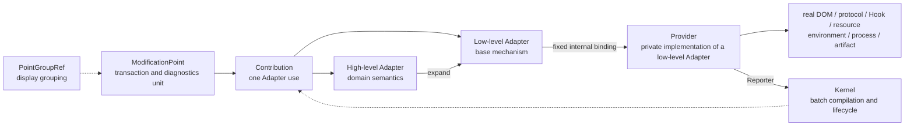

# OpenCodex Virtual Modification Skeleton: Architecture and Development Guide

[中文](MODIFICATION_SKELETON.md) | **English**

This document specifies the virtual modification skeleton for maintainers who need to understand the architecture or add built-in modification points. See [Plugins v2](./PLUGINS_EN.md) for the plugin manifest, directory layout, and build process.

The skeleton uses one consistent vocabulary and one contribution workflow. A browser, Gateway, static transformer, or Runner is a physical execution context, not a third classification of modification points.

Names such as `ThreadMessageActions` and `RuntimeViewAdapter` in the examples stand for strongly typed objects exported by the corresponding Adapter module. New code must import and use the real objects; it must never resolve them at runtime by these names or by string IDs.

## 1. Core model



Each concept answers one question only:

| Concept | Question it answers | What it explicitly does not do |
|---|---|---|
| PointGroupRef | How should developers browse points by function in the diagnostics page? | It does not decide enablement, dependencies, fallback, runtime location, or execution method. |
| ModificationPoint | Which behavior is one atomic transaction and diagnostics unit? | It does not touch real objects or perform low-level location. |
| High-level Adapter | Which more basic capabilities should a domain behavior expand into? | It does not access DOM, Node, Electron, or resource contents. |
| Low-level Adapter | Which general modification mechanism is used? | It does not classify by feature or expose real platform objects. |
| Provider | How does that base mechanism operate on real objects? | It is not public to modification points and does not participate in feature grouping. |
| Runtime Context | Which physical process or build phase executes this batch of points? | It is not a ModificationPoint field and is not inferred from an ID. |
| Kernel | How are points batch-compiled, executed, rolled back, disposed, and reported? | It does not decide business policy or search for Providers. |

The following rules are mandatory:

- A modification point ID is only for stable naming, logs, persistence, and cross-process serialization.
- An ID prefix never determines runtime location, Adapter, or Provider.
- A modification point references strongly typed Group, Adapter, Signal, Capability, Target, Locator, Slot, and Schema objects only.
- Both high-level and low-level Adapters may be used directly by modification points; prefer the most precise semantic Adapter.
- A high-level Adapter uses an Expander to declare which Adapters it depends on.
- Each low-level Adapter has one fixed internal Provider binding in a Runtime.
- The Kernel dispatches only through the binding established for an AdapterRef object; it does not look up implementations by name.
- Installation means `ready`; only a real business effect means `active`.

## 2. Core objects

### 2.1 PointGroupRef: display-only grouping

Groups organize modification points by domain:

```ts
const TokenUsageGroup = definePointGroup({
  id: "token-usage",
  name: "Token Usage",
  description: "Extracts and displays per-thread Token usage.",
  order: 70,
});
```

A group must not contain runtime semantics such as `required`, `optional`, `fallback`, `enabled`, or `canActivate`. Its status is derived from member points for display on the diagnostics page; overall status and statistics are calculated from modification points only.

### 2.2 ModificationPoint: atomic transaction boundary

A modification point contains:

- a stable ID, description, and owner;
- one `PointGroupRef`;
- one or more Adapter Contributions.

Multiple direct Contributions of the same point are atomic by default. If any Contribution fails during application, verification, or activation, the Kernel cleans up and rolls back the Contributions already attempted for that point in reverse order.

Therefore:

- Put behaviors that must succeed or fail together in one modification point.
- Split behaviors that can fail, be disabled, or be diagnosed independently into separate points.
- “Extract Token data” and “mount the Token badge” should be two separate points.

### 2.3 Contribution: the result of using an Adapter

`AdapterRef.use(declaration)` returns an AdapterUse, which is a Contribution:

```ts
const point = defineModificationPoint({
  id: "example.message-action",
  description: "Adds an example action to the message action area.",
  owner: "web-shell",
  group: RendererUiGroup,
  contributions: [
    MessageActionsAdapter.use({
      action: ExampleAction,
    }),
  ],
});
```

The direct Adapter is the Adapter used when the point is registered. Every Adapter traversed after expanding a high-level Adapter forms the complete dependency chain.

### 2.4 Adapter: strongly typed capability contract

Adapters are either:

- `composite`: a high-level Adapter that expresses domain semantics and expands through an Expander;
- `terminal`: a low-level Adapter that expresses one base modification mechanism.

Dependencies must be AdapterRef objects:

```ts
const ThreadMessageActions = defineAdapter<ThreadMessageActionsDeclaration>({
  id: "adapter.thread-message-actions",
  name: "Thread message actions",
  description: "Provides a stable semantic mount slot for message actions.",
  kind: "composite",
  dependencies: [SemanticViewAdapter],
});
```

A high-level Adapter may select one or more of its declared dependencies based on a strongly typed declaration, but it may not touch the real environment.

### 2.5 Provider: private implementation of a low-level Adapter

Only Providers may access the real DOM, protocol connections, function objects, Electron, Node, the file system, resource contents, or signing tools.

Separating Adapters from Providers keeps the modification-point project environment-independent: Adapter contracts can be used by a strict project without DOM or Node types, while Providers remain in internal platform modules.

This is not a choice among multiple implementations:

```text
RuntimeViewAdapter
    └─ fixed RuntimeViewProvider binding in the current Runtime

RuntimeHookAdapter
    └─ fixed RuntimeHookProvider binding in the current Runtime
```

The internal module for a low-level Adapter determines and creates its Provider. The Runtime supplies the current platform capabilities and installs that binding; it does not select an implementation. If an Adapter needs different internal strategies for different platforms, its own Provider factory must make that decision.

`runtime.provide(provider)` binds through the AdapterRef object identity in `provider.adapter`. Registering a second binding for the same Adapter in one Runtime fails. The Kernel reads this fixed binding for internal dispatch; it does not search, infer, or choose a strategy.

When several behaviors exist:

- Different domain mechanisms should expand through different low-level Adapters.
- Different platform strategies for one low-level mechanism are handled internally by the single Provider bound to that low-level Adapter.

The Provider batch contract is:

```ts
interface TerminalAdapterProvider<TDeclaration> {
  readonly adapter: AdapterRef<TDeclaration>;
  compile(
    contributions: readonly BoundContribution<TDeclaration>[],
  ): CompiledAdapterPlan;
}
```

`compile()` receives the complete batch of Contributions for that Adapter, so the Provider can combine location, Observers, Listeners, protocol parsing, and function Wrappers.

### 2.6 Runtime Context: physical execution context

A browser page, Gateway process, static-resource transformer, and Runner builder are different Runtime Contexts.

Each Runtime Context is responsible only for:

- explicitly registering the point objects to execute in that Runtime;
- installing internal Provider bindings for the required low-level Adapters;
- creating, activating, and disposing the Kernel;
- supplying real platform capabilities and their lifecycle.

A Runtime Context is not written into a ModificationPoint and is not inferred from its ID. The Runtime entry that registers a point object determines where that point executes.

### 2.7 SignalRef and CapabilityRef

`SignalRef<T>` represents a strongly typed data flow between Adapters. For example, a protocol Adapter can publish Token data and a view Adapter can consume it.

`CapabilityRef<T>` represents a strongly typed capability produced by an Adapter. For example, ArtifactBuild can publish a completed Runner artifact.

They are never resolved through strings and never leak real platform objects to modification points.

### 2.8 Kernel: batch compilation and one lifecycle

The Kernel:

- registers and validates Groups, Adapters, Expanders, and Points;
- checks duplicate IDs, invalid references, and Adapter dependency cycles;
- expands high-level Adapters;
- aggregates Contributions by terminal AdapterRef;
- calls the batch compiler of each already-bound Provider;
- performs atomic application, verification, activation, and reverse-order rollback per point;
- manages disposers, reference counts, and Runtime destruction;
- aggregates status, hit counts, and read-only performance diagnostics.

The Kernel does not interpret selectors, module paths, file paths, or business data.

## 3. Compilation, activation, and state

### 3.1 Registration and compilation

Every Runtime starts in this order:

```text
Register Groups / Adapters / Expanders
            ↓
Explicitly register Point objects for this Runtime
            ↓
Install low-level Adapters → fixed Provider bindings
            ↓
compile
            ↓
activate
```

The compile process:

1. Validates all object references and the dependency graph.
2. Recursively expands high-level Adapters.
3. Creates a BoundContribution for every terminal leaf.
4. Records direct Adapters, terminal Adapters, and the complete dependency chain.
5. Aggregates by terminal AdapterRef object identity.
6. Calls `compile(batch)` on the Provider already bound to that Adapter.

Compilation only creates a plan; it produces no business effect.

### 3.2 From location to a real hit

```text
Batch locate by low-level Adapter
            ↓
Atomically apply all Contributions per Point
            ↓
Verify all Contributions per Point
            ↓
Activate all Contributions per Point
            ↓
ready: implementation is prepared
            ↓
Real business path occurs
            ↓
active: Provider reports a real hit
```

Providers must explicitly report the location result for every Contribution. An omitted report must not be treated as located.

Modification points and high-level Adapters do not call the Reporter. Only low-level Providers may report:

- resolving / resolved / unsupported / ambiguous / stale;
- applying / applied / rolledBack;
- verified / verificationNotRequired;
- hit / fallback / disabled / failed.

This prevents a point from falsely reporting “hit” as soon as installation completes.

### 3.3 Five stages

| Stage | Meaning | Typical states |
|---|---|---|
| location | Was a unique, still-valid real target found? | unresolved, resolving, resolved, unsupported, ambiguous, stale, failed |
| application | Has the modification transaction been applied? | pending, applying, applied, rolled-back, disabled, failed |
| verification | Does the applied result satisfy its invariants? | pending, verified, not-required, failed |
| activation | Are listeners, callbacks, and lifecycle handling ready? | inactive, activating, ready, disposed, failed |
| exercise | Has a real semantic effect occurred? | not-exercised, active, disabled |

`activation: ready` means only that the implementation is installed. `exercise: active` means that a real business effect has occurred.

### 3.4 Aggregated point state

| State | Meaning |
|---|---|
| pending | A required stage is still waiting, or the Runtime has been disposed. |
| unavailable | Location, application, verification, or activation failed for a required Contribution. |
| degraded | The modification failed but explicitly switched to official behavior or another fallback. |
| disabled | The current configuration or platform deliberately turned it off. |
| ready | Installed and verified, but not all real effects have happened yet. |
| active | Every direct Contribution has produced a real semantic effect. |

A point with multiple direct Contributions becomes active only after all of them have produced real hits.

## 4. Low-level Adapters and selection rules

### 4.1 Seven low-level Adapters

| Adapter | Real capability the Provider may touch | Base mechanism |
|---|---|---|
| RuntimeView | DOM, layout, and browser events | Location, observation, virtual nodes, mounting, measurement, and cleanup |
| ProtocolPipeline | IPC, WebSocket, NDJSON, and similar transports | Schema validation, observation, transformation, routing, and publication |
| RuntimeHook | Functions, constructors, object properties, and module exports | before, after, around, and shared Wrappers |
| StaticResource | HTML, JavaScript, text, or binary resources | Location, transactional transformation, and output verification |
| RuntimeEnvironment | Environment variables, startup arguments, and global capabilities | Commit boundaries, overrides, and restoration |
| ProcessInterception | Child processes and system-open behavior | Ordered interception chains and call decoration |
| ArtifactBuild | Staging areas, ASAR, signing tools, and artifact directories | Assembly, validation, and atomic commit |

The standard Declarations and strongly typed Ref constructors are in `gateway/src/modification/contracts.ts`.

### 4.2 Selection order

1. Use an existing high-level Adapter when it expresses the requirement accurately.
2. When no matching high-level Adapter exists, first decide whether the domain has stable semantics or is likely to be reused; normally add a high-level Adapter first.
3. Use a low-level Adapter directly only for a one-off or experimental change, or when there is genuinely no reusable domain semantic.
4. When several mechanisms must succeed atomically, put multiple Contributions in one modification point.
5. Add a new low-level Adapter and its internal Provider only when the seven base mechanisms cannot express the requirement.

All public high-level and low-level Adapters may be used by modification points. A high-level Adapter is a preferred, more precise, more convenient abstraction, not a permissions layer.

Do not wait for a second point before abstracting: once a target, slot, protocol message, or official API is a clear and stable domain concept, create the high-level Adapter on its first use. Extract it no later than the second occurrence of the same low-level declaration.

Do not add an Adapter merely to create a diagnostics-page category; display grouping belongs to PointGroup.

## 5. Adding a built-in modification point

### 5.1 Define the point boundary first

Before adding a point, make explicit:

- which observable result represents a real hit;
- which behaviors must succeed atomically;
- whether failure means unavailable or has an explicit fallback;
- what must be released when disabled, reloaded, or when the process exits;
- which parameters, return values, exceptions, caches, throttling, and event order must remain unchanged.

Adding the skeleton boundary must not also change the business algorithm.

### 5.2 Choose a group

Prefer an existing PointGroupRef:

```ts
group: POINT_GROUPS.tokenUsage
```

Register a new group only when developers need a new domain for browsing. A group’s name, description, and order affect diagnostics display only.

### 5.3 Prefer a high-level Adapter

Assume that a “thread message actions” high-level Adapter already exists:

```ts
export const TokenUsageInlinePoint = defineModificationPoint({
  id: "web.runtime.dom.token-usage-inline",
  description: "Displays Token usage in the thread message action area.",
  owner: "web-shell",
  group: POINT_GROUPS.tokenUsage,
  contributions: [
    ThreadMessageActions.afterFork.mount({
      source: TurnTokenUsage,
      content: TokenUsageBadge,
    }),
  ],
});
```

The point declares only:

- which semantic slot it uses;
- which Signal provides the data;
- which virtual content to mount.

It does not know selectors, MutationObservers, real Elements, or insertion algorithms. `ThreadMessageActions` expands the declaration into a RuntimeView declaration, and the RuntimeViewProvider performs the real location and mount.

### 5.4 Add a semantic wrapper before using a low-level Adapter

“There is no existing high-level Adapter” does not mean “use a low-level Adapter immediately.” First check whether any of these are true:

- the target, slot, protocol message, or official API has a stable domain name;
- the low-level declaration contains a Locator, Target, Slot, Schema, or composition order likely to be repeated;
- a later point or plugin could reuse the capability;
- a shared semantic layer could merge location, observation, parsing, or Hook work.

When any condition holds, add a high-level Adapter as described in section 6 and let the point use it. This creates a stable reuse boundary on the first integration, so later points need to pass only a small number of domain parameters.

Direct low-level use is appropriate only when:

- the change is one-off or experimental and its semantics are not stable;
- the standard low-level declaration completely expresses the requirement without extra domain rules;
- you have confirmed that no Locator, Slot, Schema, Target, or composition logic will be duplicated.

Even when using a low-level Adapter directly, describe the target through strongly typed Refs:

```ts
interface MessageActionsModel {
  readonly turnId: string;
}

interface ExperimentalBadgeData {
  readonly label: string;
  readonly tone: string;
}

const MessageActionsLocator =
  defineViewLocator<MessageActionsModel>("locator.thread-message-actions");
const AfterForkPlacement =
  defineViewPlacement("placement.thread-message-actions.after-fork");
const ExperimentalBadgeState =
  defineSignal<ExperimentalBadgeData>("signal.experimental-badge-state");
const RuntimeView = createRuntimeViewApi(RuntimeViewAdapter);

export const ExperimentalBadgePoint = defineModificationPoint({
  id: "web.runtime.dom.experimental-badge",
  description: "Displays an experimental marker in the message action area.",
  owner: "web-shell",
  group: POINT_GROUPS.rendererUi,
  contributions: [
    RuntimeView.mountLowLevel({
      locator: MessageActionsLocator,
      placement: AfterForkPlacement,
      source: ExperimentalBadgeState,
      render({ data, ui }) {
        // The point creates virtual nodes only; it never touches the real DOM.
        return ui.badge({ tone: data.tone }, [ui.text(data.label)]);
      },
    }),
  ],
});
```

The RuntimeViewProvider privately registers the real resolution rules for the Locator and Placement; the point holds only object references.

As soon as a second point needs the same Locator, Placement, or mount rule, extract a high-level Adapter and switch the existing point to it as well.

### 5.5 Atomic points with multiple Contributions

Put multiple Contributions in one point only when they must succeed together:

```ts
const point = defineModificationPoint({
  id: "example.protocol-and-view",
  description: "Atomically installs a protocol transformation and its companion view.",
  owner: "example",
  group: ExampleGroup,
  contributions: [
    SemanticProtocol.observe(protocolDeclaration),
    SemanticView.mount(viewDeclaration),
  ],
});
```

If they can fail or be diagnosed independently, split them into separate points and connect them with a SignalRef.

### 5.6 Explicit registration with a Runtime

After defining a point, the Runtime that actually executes it registers the object:

```ts
browserRuntime.registerPoint(TokenUsageProtocolPoint);
browserRuntime.registerPoint(TokenUsageInlinePoint);
```

This passes a `ModificationPointDefinition` object, not a string ID. The Group and Adapters must already be registered in the same Runtime. This object-registration entry is what determines the physical execution context.

Do not do this:

```ts
// Wrong: runtime location cannot be inferred from an ID prefix.
const runtime = runtimeForId(point.id);

// Wrong: a point cannot be looked up again by string.
registerPointById("web.runtime.dom.token-usage-inline");
```

### 5.7 Ordinary new points do not add Providers

When a new point uses existing Adapters:

- do not add a Provider;
- do not let the Kernel select a Provider;
- do not install a point-specific global Observer, Listener, or Hook;
- do not manually report resolved, applied, verified, or hit;
- do not read the real DOM, protocol connection, module, or file.

The Provider already bound to the low-level Adapter processes the new Contribution in its batch.

Only a genuinely new low-level Adapter requires a new Provider implementation and binding.

### 5.8 Declarations by Runtime Context

| Runtime Context | What a point should declare | What the Provider hides |
|---|---|---|
| Browser | Semantic views, Locator Refs, Slots, virtual nodes, protocol Schemas, Hook Targets | DOM scans, Observers, Listeners, real nodes, and Wrappers |
| Gateway | Protocol Schemas, Hook Targets, Environment Keys, Process Targets | IPC/NDJSON, Electron, Node, processes, and startup boundaries |
| Static | Resource Targets, semantic Locators, candidate constraints, and output invariants | Raw resource reads, decoding, transactional changes, compression, and caching |
| Runner | Artifact Targets, build Specs, and Capabilities | Staging, copying, ASAR, signing, validation, and atomic commit |

A point must not pass real platform objects as Adapter declaration parameters.

### 5.9 Add a direct behavior test

Every new point needs at least one real behavior test:

- RuntimeView: virtual result, remount, cleanup, and hit.
- ProtocolPipeline: Schema matching, non-target frames, transformation, and publication.
- RuntimeHook: `this`, arguments, return value, Promise identity, exceptions, and ordering.
- StaticResource: matched output, byte-for-byte unchanged output on a miss, candidate ambiguity, and verification.
- ArtifactBuild: artifact structure, failure cleanup, signing, and atomic commit.

Also update the point count, Runtime registration coverage, diagnostics report, and complete Adapter-chain assertions.

## 6. Adding a high-level Adapter

Add a composite Adapter when the corresponding semantic boundary is stable and expected to be reused, or when low-level location and composition rules have started to repeat. In general, create the abstraction on the first clear recognition of a stable semantic.

### 6.1 Define a strongly typed domain declaration

```ts
interface MessageActionMountDeclaration {
  readonly source: SignalRef<unknown>;
  readonly render: (
    context: ViewRenderContext<unknown, MessageActionsModel>,
  ) => VirtualView;
}
```

The declaration contains domain parameters only. It must not contain a CSS selector, Element, WebSocket, or module object.

### 6.2 Declare dependencies and implement the Expander

```ts
const MessageActionsAdapter =
  defineAdapter<MessageActionMountDeclaration>({
    id: "adapter.message-actions",
    name: "Message actions",
    description: "Expands message-action semantics into a stable view mount.",
    kind: "composite",
    dependencies: [RuntimeViewAdapter],
  });

const RuntimeView = createRuntimeViewApi(RuntimeViewAdapter);

runtime.expand({
  adapter: MessageActionsAdapter,
  expand(declaration) {
    return [
      RuntimeView.mount({
        target: ThreadMessageActionsTarget,
        slot: AfterForkSlot,
        source: declaration.source,
        render: declaration.render,
      }),
    ];
  },
});
```

An Expander:

- may use only AdapterRef objects declared in its dependencies;
- may select different declared dependencies based on the declaration;
- may not access the real platform;
- must return at least one AdapterUse;
- must have tests for its dependency chain, invalid references, and dependency cycles.

A high-level Adapter must provide a real semantic abstraction. Adding a name while passing the declaration through unchanged has no value; use PointGroup for display-only categories.

## 7. Adding a low-level Adapter and Provider

Add a terminal Adapter only when the existing seven mechanisms cannot express a new physical integration method.

### 7.1 Low-level Adapter requirements

- an environment-independent strict Declaration;
- branded Target, Locator, Schema, Signal, or Capability Refs;
- an explicit batch key and shared-resource strategy;
- explicit location, application, verification, activation, hit, rollback, and disposal semantics;
- no Provider or real platform object exported to modification points.

### 7.2 Provider skeleton

```ts
const provider: TerminalAdapterProvider<MyDeclaration> = {
  adapter: MyTerminalAdapter,
  compile(contributions) {
    // Merge scanners, parsers, listeners, or Wrappers by target.
    const sharedPlan = compileSharedPlan(contributions);

    return {
      locate(reporter) {
        for (const contribution of contributions) {
          const target = sharedPlan.locate(contribution);
          if (target) reporter.resolved(contribution);
          else reporter.unsupported(contribution, "The target is not present in this Runtime");
        }
      },
      apply(contribution, reporter) {
        sharedPlan.apply(contribution);
        reporter.applied(contribution);
      },
      verify(contribution, reporter) {
        if (!sharedPlan.verify(contribution)) {
          throw new Error("Modification result verification failed");
        }
        reporter.verified(contribution);
      },
      activate(contribution, reporter) {
        return sharedPlan.observeEffect(contribution, () => {
          // Report a hit only after the real semantic effect occurs.
          reporter.hit(contribution);
        });
      },
      rollback(contribution) {
        sharedPlan.rollback(contribution);
      },
      dispose() {
        sharedPlan.dispose();
      },
      diagnostics() {
        return sharedPlan.metrics();
      },
    };
  },
};
```

Initialize it once per Runtime:

```ts
runtime.provide(provider);
```

`provider.adapter` is the binding key. Duplicate bindings fail; the Kernel does not find a Provider by ID, Runtime name, or string strategy.

### 7.3 Performance requirements

- Scan each identical DOM location only once.
- Use at most one MutationObserver per observation root.
- Install one Listener per identical event source.
- Decode and validate each protocol frame only once.
- Use one Wrapper per function target.
- Perform the complete transformation for each static-resource cache miss only once.
- Use reference counting for shared resources and release them when the last Contribution is disposed.
- Expose only non-negative numeric counters through diagnostics.

## 8. External plugins

External plugins use the same Group, Adapter, Point, and Kernel model, but they cannot provide terminal Providers:

```ts
import type { OpenCodexPluginFactory } from "@opencodex/plugin-sdk";

export default ((sdk) => {
  const group = sdk.groups.register({
    id: "example.message-tools",
    name: "Message tools",
    description: "A developer display group for the example plugin.",
    order: 900,
  });

  const locator = sdk.view.locators.css(
    "locator.example-message-actions",
    '[data-app-action="message-actions"]',
  );

  sdk.points.register({
    id: "example.message-tools.hello",
    description: "Appends text to the message action area.",
    group,
    contributions: [sdk.adapters.semanticView.mount({
      locator,
      placement: sdk.view.placements.append,
      content: sdk.view.ui.text("Hello"),
    })],
  });
}) satisfies OpenCodexPluginFactory;
```

The plugin sees only the frozen SDK facade and public Adapters. The Runtime has already fixed the internal Provider bindings for those low-level Adapters.

Plugins still run as trusted code; the SDK boundary is not a malicious-code security sandbox.

## 9. Reports and diagnostics

Report Schema v2 contains:

- Group names, descriptions, orders, and members;
- Adapter names, descriptions, terminal/composite kinds, and dependencies;
- each Point’s `groupId`, `directAdapterIds`, and `adapterChainIds`;
- the five-stage state, hit count, and fallback reason for every terminal Contribution.

The local Kernel snapshot also contains `providerDiagnostics`. The diagnostics page calculates overall status and top-level statistics from modification points only; group status is for group headers only.

Diagnostics entry points:

```text
/settings/developer/runtime-compatibility
/opencodex/runtime-compatibility
```

When investigating “ready but the feature is not visible”:

1. Check whether location is resolved.
2. Check application and verification.
3. Check whether activation is ready.
4. Check whether exercise is active and `hitCount` has increased.
5. Check whether Provider diagnostics counters for scans, parsing, or Hooks changed.
6. Check whether the point is disabled or entered fallback after a failure.

## 10. Repository paths

| Path | Purpose |
|---|---|
| `gateway/src/modification/sdk.ts` | Group, Adapter, Point, Signal, and Capability objects |
| `gateway/src/modification/contracts.ts` | Strict Declarations and Refs for the seven low-level Adapters |
| `gateway/src/modification/kernel.ts` | Compilation, transactions, lifecycle, Reporter, and state |
| `gateway/src/modification/catalog.ts` | Built-in Groups, Adapters, and Point catalog |
| `gateway/src/modification/production.ts` | Production batch coordinator for Gateway, static resources, and Runner |
| `web-shell/src/modification-browser-host.ts` | Browser Adapter bindings, shared resources, and Kernel integration |
| `web-shell/src/plugin-sdk.ts` | External ESM v2 plugin SDK |

## 11. Implementation alignment rules

The following are not part of the normative architecture. New code must not depend on them:

- inferring runtime location from `web.runtime.*`, `gateway.runtime.*`, or `static.cache.*` prefixes;
- `HostForPointId`, `hostForPoint()`, or `MIGRATION_MATRIX.host`;
- looking up a Point or Adapter again by string in a business module;
- registering multiple Providers for one low-level Adapter and letting the Kernel choose among them;
- treating a trusted feature-script key as an Adapter ID or Provider-selection condition;
- having a modification point call the Reporter manually or report hit when an installer finishes;
- having a new point create a global Observer, Listener, Wrapper, or protocol parser directly.

If these structures remain, they may exist only as migration compatibility bridges. They must not appear in the usage path for new modification points and should be removed during implementation alignment.

## 12. Pre-commit checklist

- [ ] PointGroup is used for display only.
- [ ] A modification point has no host/runtime field, and its ID prefix has no runtime meaning.
- [ ] The Runtime entry explicitly registers point objects.
- [ ] The point prefers a high-level Adapter; when no existing abstraction exists, reusable semantic extraction was evaluated first.
- [ ] A low-level Adapter is used directly only for a one-off, experimental, or genuinely non-reusable semantic.
- [ ] The point declaration does not touch real DOM, Bridge, Electron, Node, the file system, or resource contents.
- [ ] A high-level Adapter only expands dependencies and does not access the real platform.
- [ ] Each low-level Adapter has one internal Provider binding in the current Runtime.
- [ ] The Kernel does not search for or select Providers.
- [ ] Providers batch-manage location, observation, Hooks, protocol, and resource lifecycles.
- [ ] `ready` and real `active` are clearly distinguished.
- [ ] Failure, fallback, and disabled are reported separately.
- [ ] Parameters, `this`, return values, Promise identity, exceptions, caches, throttling, and event order are unchanged.
- [ ] The new point has a direct behavior test and Runtime registration coverage.

Run:

```bash
pnpm run typecheck:skeleton
pnpm run check:skeleton-boundaries
pnpm test
git diff --check
```
