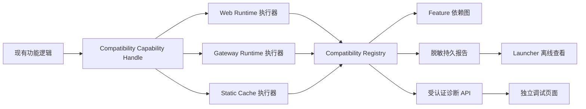

# Official Compatibility Kernel 设计与迁移说明

> 状态：已实现并作为官方兼容边界的统一控制面
> 整理日期：2026-08-28
> 适用范围：OpenCodex 对官方 Renderer、Electron Main、App Server 协议和派生 Runtime 缓存的适配

## 1. 目标

OpenCodex 需要复用官方 Codex/ChatGPT Desktop，但 Web、Gateway 和 Runner 环境与官方桌面环境不同。项目因此存在三类兼容修改：

- `web.runtime.*`：浏览器运行时的 Bridge、DOM、协议和插件适配；
- `gateway.runtime.*`：Electron、IPC、进程和 App Server 运行时 Hook；
- `static.cache.*`：官方 Main、Renderer 响应和 Runner 工作副本的派生缓存修改。

Official Compatibility Kernel 为这些修改提供统一的注册、定位、应用、验证、命中、回退和诊断模型。它不把不同底层实现强行改造成同一种 Patch 函数，而是让各执行器通过相同的生命周期对外报告。

## 2. 本轮迁移的硬性约束

兼容骨架属于结构与诊断改造，不得改变已有功能逻辑：

1. 原 Hook 的安装顺序、参数、`this`、返回值、异常、Promise、回调和事件合约保持不变；
2. 原静态转换的输出字节、幂等规则、缓存键、压缩和回退行为保持不变；
3. 原 Web 适配的 DOM 时序、观察器生命周期、开关和移动端条件保持不变；
4. 骨架自身失败时执行原实现，诊断错误不能阻断 Gateway、Runner 或 Renderer；
5. 功能组原子性当前只用于健康状态汇总，不在本轮直接改变功能启停逻辑；
6. 官方安装目录继续只读，所有静态修改只发生在 OpenCodex 派生缓存或响应体中。

## 3. 数据流



主要实现入口：

- `gateway/runtime/compatibility/registry.cjs`：Registry、正交状态和过期 Handle；
- `gateway/runtime/compatibility/catalog.cjs`：102 个稳定修改点 ID 和 6 个功能组；
- `gateway/runtime/compatibility/service.cjs`：现有实现的能力包装、浏览器回执和持久化编排；
- `gateway/runtime/compatibility/report-store.cjs`：原子报告和有界历史；
- `gateway/runtime/http/runtime-compatibility.cjs`：受认证 API；
- `web-shell/codex-runtime-compatibility.js`：浏览器侧受限回执；
- `web-shell/runtime-compatibility.*`：独立诊断页。

## 4. 稳定 ID

ID 只表达业务语义，不包含文件名、官方版本、压缩变量名、DOM 选择器或内容 Hash。版本变化由每次定位记录的 `locatorRevision` 和 `strategyId` 表达。

当前目录共 102 个修改点：

| 分类 | 数量 | 典型示例 |
|---|---:|---|
| Web 运行时 | 36 | `web.runtime.bridge.desktop-api`、`web.runtime.dom.remote-file-menu` |
| Gateway 运行时 | 36 | `gateway.runtime.electron.ipc-main`、`gateway.runtime.app-server.turn-router` |
| 静态缓存 | 30 | `static.cache.main.git-origin-resolver`、`static.cache.runner.gateway-asar` |

完整目录以 `catalog.cjs` 为唯一事实来源。测试会验证数量、分类、ID 唯一性以及功能组依赖没有悬空引用。

## 5. 正交状态模型

一个修改点不能只使用单一枚举，因为“已经安装但尚未命中”和“验证成功后正在使用回退”是不同维度。Registry 分别记录：

### 5.1 定位 `location`

- `unresolved`：尚未尝试；
- `resolving`：定位中；
- `resolved`：候选数量和强约束通过；
- `unsupported`：候选缺失或当前版本不具备该能力；
- `ambiguous`：候选超过预期，不能确认目标；
- `failed`：Locator 约束或执行失败；
- `stale`：定位完成后目标身份发生变化。

### 5.2 应用 `application`

- `pending`、`applying`、`applied`、`failed`、`disabled`。

### 5.3 验证 `verification`

- `pending`、`verified`、`failed`、`not-required`。

### 5.4 实际命中 `exercise`

- `not-exercised`：能力已安装但尚未经过真实路径；
- `active`：已命中，并记录有界计数和最后时间。

### 5.5 回退 `fallback`

回退独立记录 `active/reason/activatedAt`，不会覆盖定位或验证失败的原始信息。

以上维度派生展示状态：`healthy`、`ready`、`pending`、`degraded`、`unavailable`、`disabled`。

## 6. Locator 和 Handle 约束

1. Locator 必须声明预期候选数、实际候选数、修订号和策略 ID；
2. 只有强约束通过才能得到 Handle；模糊候选只进入诊断状态；
3. Handle 内部绑定 Registry generation、运行时身份和目标指纹；
4. 新定位批次或官方运行时身份变化会使旧 Handle 失效；
5. 应用前重新读取目标指纹，不一致时标记 `stale`；
6. Handle 只能应用一次，防止重复安装 Hook；
7. 功能代码只拿到受控能力函数，不读取 Registry 内部 Token 或原始目标；
8. 诊断命中失败不得影响能力函数的原始返回值。

为了保持迁移前语义，旧静态优化在“同一文件部分结构仍可安全识别”时继续应用已有安全命中，同时把对应点标记为降级。后续若要启用更严格的整组拒绝策略，需要单独设计开关、灰度和输出等价验证，不能借本次结构迁移暗中改变行为。

## 7. 功能依赖组

当前定义六个跨层功能组：

- `feature.startup-history`：首屏、历史会话和侧栏同步；
- `feature.workspace-creation`：新项目和新工作树；
- `feature.remote-files`：远端文件预览和下载；
- `feature.smart-routing`：Auto 模型智能调度；
- `feature.notification-power`：通知和隐藏 Runtime 节能；
- `feature.renderer-core-bridge`：官方 Renderer 与 Gateway 核心桥。

必需点失败时功能组显示 `unavailable`，存在回退或可选点失败时显示 `degraded`。智能调度关闭时对应功能组显示 `disabled`。

## 8. 三类执行器

### 8.1 Web 运行时

`codex-runtime-compatibility.js` 在其它 Renderer 扩展之前加载，生成页面级 `clientId`，并提供固定的 `installed/active/failed/fallback/disabled` 回执。Gateway 只接受目录中已有的 `web.runtime.*` ID，浏览器不能伪造 Gateway 或静态缓存状态。

回执使用短批次提交；失败时指数退避，页面隐藏后停止重试，避免诊断功能制造持续网络唤醒。

### 8.2 Gateway 运行时

官方 Bootstrap 前的环境、Electron、IPC 和进程 Hook 通过同步能力包装执行。包装失败时立即执行原安装函数。App Server 的 Transport、虚拟模型、Turn 路由、内部会话过滤、路由元数据和历史上下文沿现有协议路径记录命中。

### 8.3 静态缓存

- `OfficialRuntimeOptimizer` 的 8 个点继续生成与迁移前一致的派生 Main 缓存；
- Renderer HTML/JS 的 17 个点通过静态资源能力包装执行，大型资源 Worker 内也创建同一骨架；
- Runner 的 5 个点在 Launcher 构建阶段执行，并把固定 ID 回执传给 Gateway；不适用于当前平台的点显示 `disabled`。

## 9. 诊断与安全

最新报告原子写入：

```text
<runtimeDir>/compatibility-report.json
```

按官方运行时身份保留最近 10 份历史：

```text
<reportsDir>/compatibility/compatibility-<version>-<build>-<hash>.json
```

受认证接口：

```text
GET  /api/opencodex/runtime-compatibility
POST /api/opencodex/runtime-compatibility/reports
```

受认证独立页面：

```text
/settings/developer/runtime-compatibility
```

兼容入口 `/opencodex/runtime-compatibility` 指向同一页面。

报告只包含稳定 ID、版本、Build、摘要 Hash、候选数量、状态、时间和脱敏原因，不包含官方源码片段、用户消息、访问令牌或本机路径。Gateway 未启动成功时，Launcher 直接读取持久报告；Gateway 正常运行时则打开独立页面。

## 10. 验收与回归

必须持续满足：

- Registry 状态转换、候选拒绝、过期 Handle、功能组和脱敏测试；
- 报告原子写入、历史上限、API 白名单和浏览器防伪测试；
- 官方 Main 优化器迁移前后输出等价；
- Renderer HTML/JS 转换、Worker、大资源缓存和压缩输出等价；
- Electron、IPC、App Server、Launcher 和 Web 插件原有测试全部通过；
- 所有 Web 脚本通过语法检查，Gateway TypeScript 构建通过；
- `git diff --check` 无空白错误，最终工作树只包含本次兼容骨架改动。

任何 Review 发现的行为差异都应先修复，再重新执行专项与全量测试，直到不再存在已知问题。
