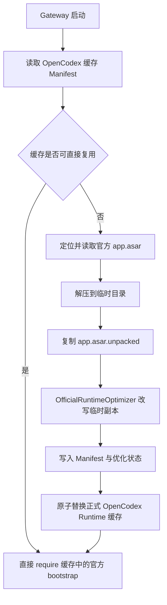

# Official Runtime 优化现状与运行时迁移方案

> 状态：讨论结论与后续实施设计
> 整理日期：2026-08-13
> 适用范围：OpenCodex 复用本机 Codex/ChatGPT Desktop 官方运行时时的隐藏 Gateway 进程

## 1. 核心结论

1. 当前 `OfficialRuntimeOptimizer` **会修改缓存文件**。它修改的是 OpenCodex 从官方 `app.asar` 解压出来的私有工作副本，不是系统中已安装的 Codex/ChatGPT Desktop，也不会回写官方 `app.asar`。
2. 这些修改不是临时手工操作。每次需要重建官方 Runtime 缓存时，`LocalCodexBundleProvider` 都会在临时目录中调用优化器，然后把处理后的目录原子替换为正式缓存。
3. 缓存命中时不会再次执行优化器；已写入缓存的修改会持续生效，直到缓存被删除或重建。重建时会从官方源重新解压，并重新应用当前版本的优化逻辑。
4. 当前方案依赖官方压缩代码中的日志标记和具体代码结构，因此会受到官方更新影响。已有布局识别、幂等处理、Manifest 状态和告警降低了风险，但无法消除对压缩产物结构的依赖。
5. 将优化迁移到**稳定的运行时边界**，例如 Electron API、IPC handler 或稳定的 Worker 消息协议，整体上会明显提高官方升级兼容性。
6. 仅把同一套正则改写从磁盘移动到 `Module._compile` 等内存加载阶段，只能做到“不落盘”，不会实质改善对官方更新的稳定性，反而会增加模块加载和调试复杂度。
7. 推荐最终采用混合迁移：优先使用稳定边界 Hook；暂时无法拦截的内部逻辑保留最小兼容层；待行为和性能验证等价后，再移除持久化源码改写。

## 2. 术语与边界

本文中的几个对象必须严格区分：

- **官方安装源**：系统中已安装应用的 `Codex.app`、`ChatGPT.app`、`app.asar` 和 `app.asar.unpacked`。
- **OpenCodex Runtime 缓存**：从官方安装源抽取后，位于 OpenCodex 可写目录中的工作副本。默认路径是 `.data/cache/codex-official-bundle`，也可能由 `CODEX_WEB_OFFICIAL_BUNDLE_DIR` 或 `CODEX_WEB_RUNTIME_DIR` 改写。
- **隐藏官方 Runtime**：由 Gateway 启动、用于提供官方 IPC、状态和 app-server 能力的 Electron Runtime。该进程设置 `OPENCODEX_GATEWAY_HIDDEN_RUNTIME=1`。
- **缓存源码改写**：对已解压缓存中的 `.vite/build/*.js` 做字符串/正则替换，即当前 `OfficialRuntimeOptimizer` 的方式。
- **稳定边界 Hook**：在官方 bootstrap 加载前包装 Electron API、IPC 注册入口、稳定服务接口或消息协议，不修改官方 JS 文件。
- **内存源码改写**：模块加载时临时改写源码，但不写回磁盘。它仍属于源码结构适配，不等同于稳定边界 Hook。

## 3. 当前缓存的生成与修改时机

当前完整流程如下：



也就是说，缓存修改发生在：

```text
官方 app.asar
  -> 解压到 codex-official-bundle.tmp-<pid>-<timestamp>
  -> OfficialRuntimeOptimizer.optimize(tmpDir)
  -> 写入 manifest.json
  -> 原子替换 codex-official-bundle
```

`OfficialRuntimeOptimizer` 不在每次普通页面请求中执行，也不在缓存命中时反复写文件。它只参与缓存刷新流程。

### 3.1 会触发缓存重建的情况

开启官方更新扫描时，以下情况会触发重建：

- Manifest 不存在或无法读取；
- Manifest schema 版本变化；
- Manifest 缺少 `runtimeOptimizations`；
- Manifest 缺少官方 `app.asar` 的大小或修改时间；
- 官方 `app.asar` 的大小或修改时间发生变化；
- 缓存中的 Webview、入口文件、`package.json`、`node_modules` 等不完整。

`CODEX_WEB_OFFICIAL_AUTO_SCAN_UPGRADE` 默认不为 `0`，因此默认会检查官方源身份。将其设为 `0` 后，如果现有缓存完整且 Manifest 可用，启动会跳过官方版本扫描并直接复用缓存；缓存不可用时仍会扫描一次以完成重建。

### 3.2 修改能持续多久

- 修改会在当前 OpenCodex Runtime 缓存中持续存在，不是仅当前 Node/Electron 进程有效。
- Gateway 重启后，只要继续命中同一缓存，修改仍然有效。
- 官方升级或缓存失效后，缓存会从官方源重新生成，优化器会按届时的实现再次处理新副本。
- 如果未来移除优化器，已有缓存不会凭空恢复；需要重建缓存后才会得到未改写的副本。
- 删除 OpenCodex Runtime 缓存不会影响官方安装，之后可以从官方源重新生成。

## 4. `OfficialRuntimeOptimizer` 当前做了什么

优化器扫描缓存中 `.vite/build/*.js` 文件。它先用相对便宜的字符串标记筛选候选 chunk，再用精确正则识别目标结构，只写回真正发生变化的文件。

所有改变官方行为的代码均以 `OPENCODEX_GATEWAY_HIDDEN_RUNTIME=1` 为主要保护条件，正常官方桌面进程不会执行这些 Gateway 专用分支。

### 4.1 Native Pet

当前包含三项处理：

- 隐藏 Runtime 中让 Native Pet factory 返回 `null`，复用官方非 macOS 路径对应的 CSS fallback；
- 跳过不可见 Native Pet renderer 的启动预热；
- 不根据隐藏 profile 中遗留的 `electron-avatar-overlay-open` 状态恢复宠物窗口。

目的：避免 Gateway 启动时创建没有用户可见价值的额外 renderer，减少内存、CPU、GPU 唤醒、耗电和发热。

### 4.2 macOS Push 注册

隐藏 Runtime 没有官方签名 entitlement，系统 Push 注册没有实际价值且可能持续失败。当前方案在隐藏 Runtime 中跳过官方 macOS Push 注册；Web 通知继续使用现有 WebSocket 通知桥。

### 4.3 侧栏 Git discovery

此部分用于避免首屏侧栏和历史会话元数据触发大量重复或长时间阻塞的 Git/文件系统工作：

- 只有同时满足“隐藏 Runtime、本地主机、调用方没有显式 timeout、请求属于 `git-origins` 或侧栏 PR 芯片的 `stable-metadata`”时，才使用 Gateway 的后台保护逻辑；
- 在 readiness、锁和子进程创建之前设置 1 秒保护时限；
- 向上检查仓库标记，确认不是仓库时返回标准 Git code 128 结果，避免创建无意义 Git 子进程；
- 完全相同的后台 Git 命令按 host、cwd 和 args 合并在途请求；缓存最多 512 项；
- 成功结果短期缓存 5 秒；失败从 1 分钟开始指数退避，最长 30 分钟；存在旧失败结果时先返回旧值并在后台单次刷新；
- Origin 查询按 host 和目录合并，最多缓存 256 项，同时最多执行 4 个任务；成功缓存 5 秒，特定慢失败缓存 60 秒；
- 本地 stat 按 host 和 path 合并，最多缓存 256 项；软超时为 1.5 秒，成功缓存 5 秒，慢错误缓存 60 秒；
- 对不明确的文件系统异常保持保守行为，尽量回到官方逻辑，避免把真实仓库误判为非仓库。

这里的“软超时”只是不再等待结果，不能真正取消已经发出的底层 stat 或 Git 工作；这是当前方案的一个明确限制。

### 4.4 Worktree shell environment

对 `worktree-shell-environment-config` 处理器进行以下保护：

- 按 hostId 和 cwd 合并完全相同的在途请求；
- 缓存最多 128 项；
- 2 秒仍未返回时，先返回官方协议支持的 `{ shellEnvironment: null }`；
- fallback 缓存 60 秒，避免失效挂载或慢 shell 初始化持续阻塞页面；
- 底层任务晚到成功后，用真实结果替换 fallback，并按成功结果缓存 5 秒；
- 底层任务晚到失败时保留 fallback。

### 4.5 幂等与兼容状态

优化器通过注入标记和“已优化结构”模式避免重复改写。处理结果会写入 Manifest，当前状态值包括：

- `gateway-css-fallback`；
- `gateway-lazy`；
- `gateway-disabled`；
- `gateway-coalesced`；
- `not-present`；
- `unsupported-layout`。

Manifest 同时记录 `patchedFileCount` 和 `unsupportedFiles`。如果官方结构变化，已安全识别的局部适配仍可应用，未识别部分会记录为 `unsupported-layout` 并输出告警，但不会阻断 Gateway 启动。

## 5. 当前方案受官方更新影响的程度

结论：**会受影响，且 Git discovery 部分最敏感。**

当前方案的识别依据包括：

- 官方日志文本；
- 函数参数和压缩后语句的排列；
- 对象字面量中 handler 的形态；
- 某些调用链和局部变量之间的结构关系。

官方即使只升级打包器、调整压缩器、重排条件或重构函数，也可能使正则不再命中，而业务语义本身未必发生变化。

### 5.1 已有保护

- 先用日志 marker 缩小扫描范围；
- 同时识别原始结构和已优化结构，保证重复执行基本幂等；
- 一个 chunk 中出现多份实现时，要求识别数量覆盖 marker 数量；
- Manifest 记录能力状态和不支持文件；
- 结构不匹配时告警并尽量保留官方原行为；
- 有针对性的兼容测试覆盖命中、重复执行、部分布局和不支持布局。

### 5.2 仍然存在的风险

1. **Marker 消失的静默退化**：如果官方连日志文本也删除或改名，当前实现可能得到 `not-present`，无法区分“能力真的删除了”和“探测锚点失效了”。
2. **结构变化导致失配**：marker 仍在但正则不再匹配时，会得到 `unsupported-layout`，对应优化失效。
3. **语义变化但语法仍命中**：这是更危险的情况。正则可能成功替换，但官方函数语义已经改变，单靠结构识别不能证明行为仍然正确。
4. **部分适配状态**：一个文件中部分结构可识别、部分不可识别时，会应用安全命中的部分并告警；因此运行时可能处于部分优化状态。
5. **缓存内容不再等同于官方解压结果**：虽然不修改官方安装，但排障时必须意识到 OpenCodex 缓存是处理后的工作副本。
6. **软超时不取消底层工作**：页面可以提前返回，但慢 I/O 或任务仍可能在后台占用资源。

## 6. 运行时方案的稳定性判断

“运行时方案”需要分成两类，二者稳定性完全不同：

| 方案 | 是否改缓存 | 对官方压缩结构的依赖 | 官方更新兼容性 | 主要风险 |
| --- | --- | --- | --- | --- |
| 当前缓存正则改写 | 是 | 高 | 较低 | 官方 chunk 或压缩结构变化 |
| 加载时内存正则改写 | 否 | 高 | 较低 | 同样会失配，且加载器更复杂 |
| Electron API / 模块边界 Hook | 否 | 低 | 高 | 全局包装范围、API 合约保持 |
| IPC handler / 服务边界 Hook | 否 | 低到中 | 高 | channel 或协议变化 |
| 稳定 Worker 消息协议 Hook | 否 | 中 | 中到高 | 消息格式或 worker 拆分变化 |
| 宽泛 `child_process` Hook | 否 | 中 | 中 | 容易误伤无关命令和返回语义 |

因此，只有迁移到 Electron API、IPC handler、稳定服务接口或 Worker 协议等**稳定边界**，稳定性才会真正提高。把正则改写改成纯内存形式，主要收益只是缓存字节保持原样，并不是兼容性提升。

## 7. 推荐的目标架构

建议拆成三个职责清晰的层：

### 7.1 `OfficialRuntimeCompatibilityProbe`

只读探测，不改写任何官方文件：

- 记录官方版本、build、可用 IPC channel、Electron API 和协议能力；
- 区分“能力不存在”“探测失败”“Hook 已安装”“Hook 已命中”；
- 为每项优化输出健康状态和降级原因；
- 官方更新后优先暴露兼容性变化，而不是静默退化。

### 7.2 `OfficialRuntimeHooks`

在 `require(officialBundle.bootstrapPath)` 之前安装边界 Hook：

- Electron 模块/API Hook；
- `ipcMain.handle/on` 注册包装；
- 精确的 Worker/消息协议中间层；
- 必要时对严格匹配的进程调用做保护。

项目现有的 IPC 注册捕获、BrowserWindow、通知、Tray 和 app-server spawn Hook 已经证明这条路径可行。后续优化应沿用同一安装顺序和健康状态体系。

### 7.3 可选的最小源码兼容层

只有在确实找不到稳定边界时才保留，并遵守：

- 优先缩小到单一能力；
- 明确版本/能力指纹；
- 失败时保持官方行为；
- 不允许静默命中未知语义；
- 作为可删除的过渡方案，不再继续扩大正则覆盖面。

不建议为了“不写磁盘”而引入通用 `Module._compile` 源码改写器。除非某项能力无其他入口，否则它只会把现有脆弱性从缓存生成阶段移动到每次启动阶段。

## 8. 各项优化的迁移建议

| 当前优化 | 推荐运行时边界 | 可行性 | 预期稳定性 | 说明 |
| --- | --- | --- | --- | --- |
| macOS Push 注册 | 精确包装 Electron Push 注册 API | 高 | 高 | 隐藏 Runtime 中返回兼容结果，普通桌面路径不变 |
| Worktree shell environment | 包装 `worktree-shell-environment-config` handler | 高 | 高 | channel 语义比压缩函数结构稳定，可保留合并、超时和晚到刷新 |
| Git Origin / stable metadata | 优先包装业务 handler 或 Worker 消息协议 | 中到高 | 中到高 | 能获得请求类型、host、cwd 等完整上下文，适合精确限流和缓存 |
| Git 子进程超时 | 仅作为下层兜底，精确匹配命令和调用上下文 | 中 | 中 | 不应依赖宽泛全局 `child_process` 拦截来实现主缓存逻辑 |
| Native Pet 恢复与辅助窗口 | IPC 状态入口 + 有选择的 BrowserWindow Hook | 中 | 中到高 | 窗口角色需可靠识别，不能禁止主隐藏 renderer |
| Native Pet factory / prewarm | 优先寻找公开 facade 或稳定窗口角色；无入口时保留最小兼容层 | 中低 | 中 | 内部函数未导出，是迁移中最困难的一项 |

### 8.1 为什么不应直接在 `child_process` 层缓存 Git

进程层通常缺少上层请求语义，难以准确判断某个 Git 命令来自首屏侧栏、用户主动操作还是其他后台任务。伪造或复用 `ChildProcess` 还必须完整保持：

- stdout/stderr stream；
- `close`、`exit`、`error` 等事件顺序；
- callback 和 Promise 两种调用方式；
- `util.promisify.custom` 返回的 `{ stdout, stderr }` 合约；
- kill、pid、退出码和错误对象字段。

现有 app-server spawn Hook 已经专门恢复了 `util.promisify.custom` 语义，这说明底层全局 Hook 必须非常谨慎。Git 的主优化更适合放在拥有业务上下文的 handler 或 Worker 协议层。

## 9. 运行时 Hook 的强制设计约束

为了确保“不影响现有逻辑”，迁移实现必须满足以下规则：

1. **仅隐藏 Runtime 生效**：所有行为变化都要求 `OPENCODEX_GATEWAY_HIDDEN_RUNTIME=1`。
2. **安装顺序固定**：Hook 必须在官方 bootstrap 第一次加载和注册 handler 之前安装。
3. **精确匹配**：只拦截明确的 API、channel、消息类型、host、cwd、args 和请求场景，不做宽泛猜测。
4. **保留原实现**：任何无法确认的调用必须原样转发给官方实现。
5. **Fail open**：探测失败或 Hook 安装失败时优先保留官方行为，同时记录告警，不用错误 fallback 覆盖真实数据。
6. **完整保持合约**：保留 `this`、参数、同步/异步返回、异常类型、回调、事件、属性描述符、原型和 `promisify` 语义。
7. **有界资源**：所有缓存、队列、并发数和退避时间必须有上限；定时器应允许进程自然退出。
8. **可观测**：每个 Hook 记录 installed、supported、interceptCount、fallbackCount、timeoutCount、lastError 和最后命中时间。
9. **可独立关闭**：每项优化使用独立开关，避免单项兼容问题导致整套 Runtime 无法启动。
10. **不双重执行**：迁移期不能同时让缓存补丁和新 Hook 对同一请求重复缓存、重复超时或重复降级。

## 10. 建议迁移步骤

### 阶段 0：冻结现状基线

- 保存每项现有优化的单元测试、集成测试和性能数据；
- 记录冷启动、热启动、首屏、历史会话加载、打开会话、Git 子进程数、CPU 和内存基线；
- 给当前 Manifest 状态补齐诊断输出，明确哪些能力正在使用缓存补丁。

### 阶段 1：建立只读兼容探测与 Hook 状态

- 引入 `OfficialRuntimeCompatibilityProbe`；
- 为各 Hook 建立统一状态模型；
- 官方升级时能够明确显示“协议变化”“能力缺失”或“尚未命中”。

### 阶段 2：迁移高确定性能力

- 先迁移 macOS Push；
- 再迁移 Worktree shell environment；
- 对比新旧路径的返回值、超时行为、缓存命中和晚到结果更新；
- 验证等价后，移除对应缓存改写。

### 阶段 3：迁移 Git discovery

- 定位具有完整业务上下文的 handler 或 Worker 协议；
- 在该层实现仓库预检、在途合并、有界并发、成功短缓存和失败退避；
- 用户主动 Git、远端 host 和显式 timeout 必须始终走官方原路径；
- 底层进程 Hook 只保留严格范围的超时兜底。

### 阶段 4：迁移 Native Pet

- 先迁移状态恢复和辅助窗口抑制；
- 再寻找 factory/prewarm 的稳定 facade；
- 如果没有可靠边界，只为剩余内部入口保留最小源码兼容层。

### 阶段 5：移除持久化缓存改写

- 所有能力通过运行时 Hook 验证等价后，停止修改 `.vite/build/*.js`；
- `OfficialRuntimeOptimizer` 改为只读兼容探测器，或被新的 Probe 取代；
- 提升 Manifest schema，使旧的已改写缓存强制从官方源重建；
- 验证新缓存 JS 与官方解压结果一致，不残留历史注入标记。

## 11. 验收标准

### 11.1 功能等价

- 新建项目、普通目录和 Git worktree 的工作区行为不变；
- 用户主动 Git 操作、远端设备、显式 timeout 不受后台优化影响；
- 历史会话、打开会话、通知、插件、终端和文件操作保持现有语义；
- 官方 Runtime 初始化、app-server、IPC 和主隐藏 renderer 正常工作；
- 关闭任意单项优化后，系统可无损回退到官方行为。

### 11.2 性能与资源

- 冷启动和首屏达到既定秒级目标；
- 热启动缓存命中不引入磁盘改写；
- 同一工作区的重复 Git/shell 请求能够合并；
- Git 子进程数、CPU 峰值、持续 CPU、内存和能耗不高于当前优化方案；
- 慢挂载、云盘占位目录和失效路径不会长期阻塞页面。

### 11.3 官方升级兼容

- 至少使用当前官方版本和一个模拟结构变化版本测试；
- API/channel/协议不可用时产生明确状态和告警；
- Hook 失败时官方 Runtime 仍可启动；
- 不依赖压缩变量名或无语义保证的语句排列；
- 对 Electron 方法、构造器、事件和 Promise/callback 合约有专项测试。

### 11.4 缓存完整性

- 迁移完成后，不再写改 `.vite/build/*.js`；
- OpenCodex 缓存仍允许包含自身的 `manifest.json`，但官方 JS 内容应与刚解压的官方源一致；
- 缓存重建继续使用临时目录和原子替换，失败时能恢复旧缓存；
- 删除缓存后可以从官方安装源完整恢复。

## 12. 回滚策略

- 每个运行时 Hook 都有独立开关，可单独关闭；
- 新 Hook 异常时回退到保存的官方原函数；
- 迁移期间保留旧优化实现，但同一能力只能启用一条执行路径；
- 如果某个官方版本改变协议，可临时关闭该 Hook 并恢复官方默认行为；
- 若必须短期恢复缓存补丁，应通过 Manifest schema 强制重建，不能在未知旧缓存上叠加改写。

## 13. 最终建议

推荐方向是：**从“修改缓存中的官方压缩代码”逐步迁移到“在官方 bootstrap 之前安装、基于稳定 API/IPC/Worker 边界的精确运行时 Hook”。**

这一方向能同时获得：

- 不修改缓存中的官方 JS；
- 更低的官方版本升级敏感度；
- 更清晰的能力探测和故障降级；
- 更容易按功能独立关闭和回滚；
- 更直接的运行时命中与性能观测。

但不能把“运行时”简单理解成“把正则替换搬进内存”。真正提升稳定性的关键不是修改发生在磁盘还是内存，而是从不稳定的压缩实现细节迁移到有明确语义和合约的运行时边界。

## 14. 当前相关实现入口

- `gateway/src/official/OfficialRuntimeOptimizer.ts`：当前缓存源码适配和 Manifest 优化状态；
- `gateway/src/official/LocalCodexBundleProvider.ts`：缓存复用、刷新、优化器调用和原子替换流程；
- `gateway/src/official/OfficialBundleCache.ts`：缓存完整性、刷新策略和 Manifest；
- `gateway/src/official/constants.ts`：缓存 Manifest schema 和默认缓存路径；
- `gateway/runtime/ipc/official-runtime.cjs`：官方 bootstrap 前的现有 Runtime Hook 安装入口；
- `gateway/runtime/electron/official-tray-hook.cjs`：基于稳定模块边界替换官方能力的现有示例；
- `gateway/test/official-desktop-compat.test.cjs`：官方缓存适配和兼容性测试。
