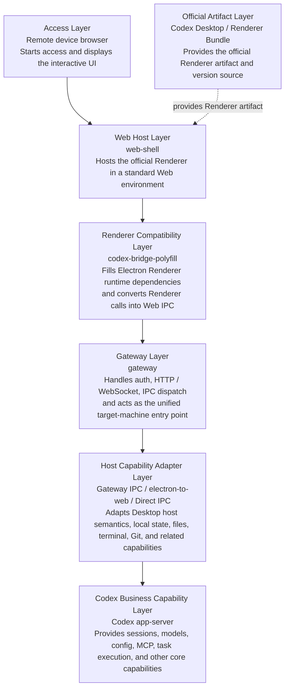

# OpenCodex

[中文](../README.md) | **English**

OpenCodex is a lightweight implementation of a Codex runtime environment. It runs the official Codex Renderer in a standard Web environment, allowing users to remotely access and operate Codex running on a target machine from any device and network.

In one line:

```text
browser -> web-shell -> official Codex renderer -> bridge polyfill -> gateway -> Codex app-server / local host capabilities
```

---

Bad timing: just as this project was about to be open sourced, ChatGPT App added Codex support.

OpenCodex still has several advantages compared with the official mobile path:

1. No proxy setup required.
2. No Google Play account required.
3. Full Codex feature support, including file tree, terminal, review, and other workflows that make AI coding practical anytime and anywhere.

> This software is currently a beta version and may still have issues. If you find a problem, please report it through an issue so the developer can fix it.

<p align="center">
  
  &nbsp;
  
  &nbsp;
  
  &nbsp;
  
</p>

## Core Components

The project has three main parts:

| Module | Purpose |
| --- | --- |
| `web-shell/` | Browser entry point for loading the official renderer and providing the renderer runtime environment. |
| `gateway/` | Local Node gateway that provides HTTP, WebSocket, IPC compatibility, local files, git, terminal, state sync, and app-server forwarding. |
| `/electron-to-web/` | Electron semantics adapter. The gateway prefers it by default to reuse Electron IPC behavior, with a self-implemented `DirectGatewayElectronIpcPort` as an alternative. |

This software **does not modify** Codex code. It only uses the corresponding Renderer artifacts.

When the Gateway starts, it automatically checks whether the local Codex installation has been updated. If an update is found, it automatically refreshes the Renderer artifacts used by OpenCodex, which means it follows the corresponding Codex version.

## Architecture Overview



Core principles:

- Reuse the official Renderer instead of rewriting the main UI.
- Keep browser-side code focused on host-environment compatibility.
- Let the gateway own local capabilities and app-server proxying, so remote browsers do not directly access local tokens or the app-server.
- Record uncovered Desktop IPC calls in `reports/unknown-ipc.jsonl` and bridge them incrementally.

## Requirements

- Node.js 20 or newer
- npm
- Codex Desktop installed locally, recommended, or explicit environment variables pointing to the Codex Desktop app or official bundle.
- macOS / Windows. macOS is fully supported; Windows has not been tested yet.

Install dependencies:

```bash
npm install
```

## How To Use

Build first:

```bash
npm run build:vendor
```
```bash
npm run build:gateway
```

Start the service:

```bash
HOST=0.0.0.0 PORT=3737 CODEX_WEB_PASSWORD=your-password npm run web:dev
```

Health check:

```text
curl http://127.0.0.1:3737/api/health
```

Remote access:

Use Tailscale, ZeroTier, a company VPN, or a similar private network solution for secure **remote LAN** access. **Direct public exposure is not recommended**.

## Environment Variables

| Variable | Default | Description |
| --- | --- | --- |
| `HOST` | `0.0.0.0` | Gateway bind address. The default is intended for remote access. |
| `PORT` | `3737` | Gateway port. |
| `CODEX_WEB_PASSWORD` | empty | **Strongly recommended. Enables gateway password protection; remote access is not secure without it.** |
| `CODEX_WEB_AUTH_TOKEN_TTL_MS` | `43200000` | Gateway access token lifetime. The default is 12 hours. |
| `CODEX_WEB_DEBUG` | empty | Set to `1` or `true` for verbose debug logs. |
| `CODEX_WEB_SLOW_LOG_MS` | `750` | IPC slow-call logging threshold. |
| `CODEX_WEB_LOCAL_FILE_TOKEN_TTL_MS` | `300000` | Lifetime for local file preview URL tokens. |
| `CODEX_DESKTOP_APP_PATH` | auto scan | Explicit path to the Codex Desktop app or its `app.asar`. |
| `CODEX_WEB_OFFICIAL_BUNDLE_DIR` | `cache/official-bundle` | Cache directory for extracted official webview assets. |
| `CODEX_WEB_IPC_IMPL` | `electron-to-web` | Set to `direct` to use the direct IPC fallback implementation. |

## Files / Directories

| Path | Description |
| --- | --- |
| `gateway/src/server.ts` | Gateway entry point. It wires HTTP, WebSocket, auth, official bundle loading, IPC, and app-server integration. |
| `gateway/src/codex-app-server.ts` | Codex app-server client for connection management, request forwarding, startup cache warmup, and health status. |
| `gateway/src/ipc/` | Gateway IPC abstractions and Electron/Codex compatibility implementations. |
| `gateway/src/official/` | Codex Desktop `app.asar` scanning, identification, caching, and webview extraction. |
| `web-shell/index.html` | Browser bootstrap shell for login, settings, and loading the patched official renderer. |
| `web-shell/codex-bridge-polyfill.js` | Browser-side Electron/Codex bridge polyfill. |
| `reports/unknown-ipc.jsonl` | Runtime log for unknown IPC calls. |

## npm Scripts

| Script | Description |
| --- | --- |
| `npm run build:gateway` | Compile `gateway/src` into `gateway/dist`. |
| `npm run web:dev` | Start the compiled gateway. |
| `npm run build:vendor` | Build `vendor/electron-to-web`. |
| `npm run test:vendor` | Run `vendor/electron-to-web` tests. |

## Troubleshooting

### Chat history is empty after opening a session

The first load can be slow and is affected by remote LAN bandwidth. If the history is not visible at first, wait for a while and it should appear.

### The page does not open after startup

Check whether the gateway is listening:

```bash
curl http://127.0.0.1:3737/api/health
```

If the port is already in use, start on another port:

```bash
PORT=3738 npm run web:dev
```

### Codex Desktop official bundle is not found

Set the Codex Desktop path explicitly:

```bash
CODEX_DESKTOP_APP_PATH="/Applications/Codex.app" npm run web:dev
```

You can also choose the bundle cache directory:

```bash
CODEX_WEB_OFFICIAL_BUNDLE_DIR="./cache/official-bundle" npm run web:dev
```

### IPC behavior is incomplete

Inspect unknown IPC logs and report them to the developer:

```bash
tail -f reports/unknown-ipc.jsonl
```
