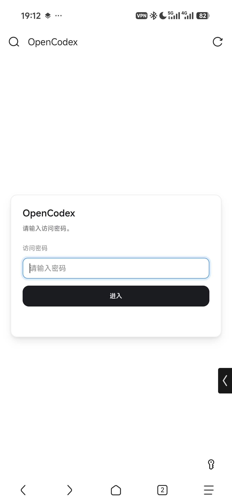
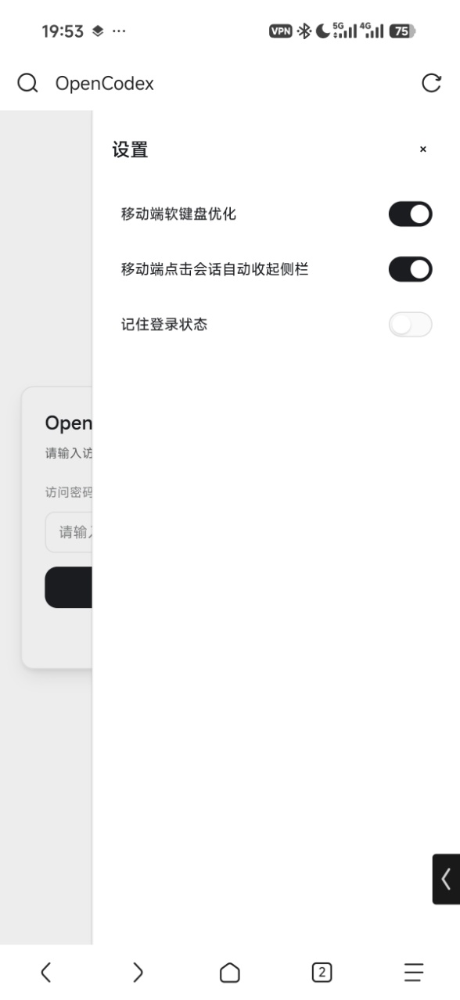
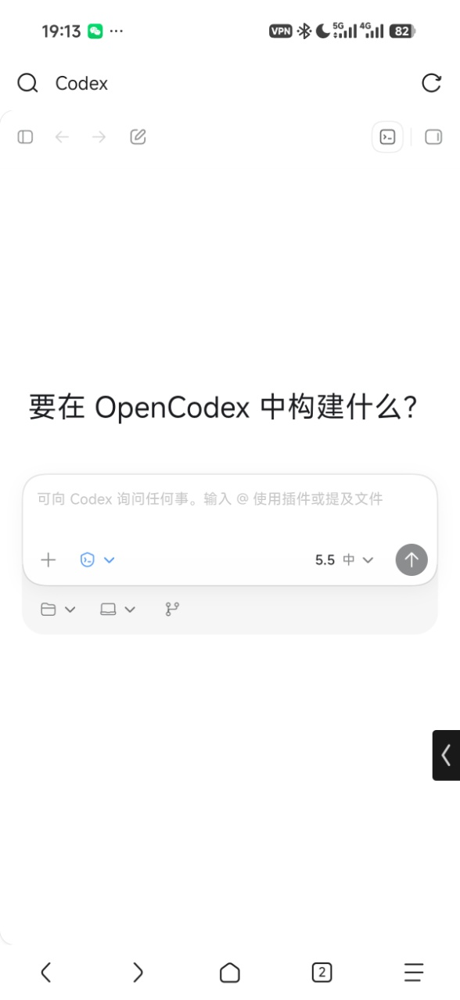
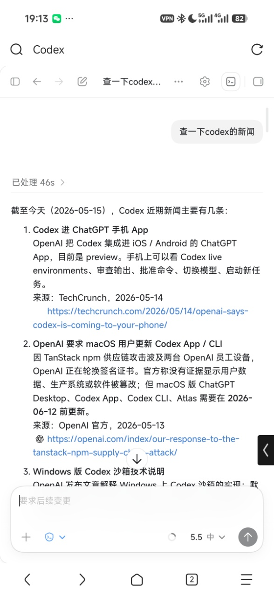

# OpenCodex

[中文](../README.md) | **English**

OpenCodex is a middleware layer for Codex Desktop. It lets you use a phone, tablet, or another computer to access and operate Codex on a target machine through a browser, making it suitable for continuous AI Coding in LAN or remote LAN environments.

---

Bad timing😭 Just as this project was about to be open sourced, ChatGPT App added Codex support.

Compared with the official option, OpenCodex still has advantages in several usage scenarios:

1. No proxy network required.
2. No overseas Google Play / Apple account required.
3. Supports full Codex capabilities, including file tree, terminal, review, and more, making anytime-anywhere AI Coding easier.

---

## Features

- Access Codex on the target machine through a browser, with no proxy network or extra account requirements, and support for phones, tablets, computers, and other devices.
- Native Codex experience.
- Supports local access, LAN access, and remote LAN access with Tailscale / ZeroTier / VPN.
- Supports setting an access password to avoid unauthenticated exposure.
- Provides a launcher for visual configuration of the listen address, port, access password, and more.
- Automatically updates to the local Codex Desktop version on startup, keeping compatibility with new-version features.
- Provides optimizations for mobile devices.

<p align="center">
  
  &nbsp;
  
  &nbsp;
  
  &nbsp;
  
</p>

## Requirements

- Node.js environment.
- pnpm.
- Codex Desktop installed locally. It does not need to be running, and it can still be used at the same time.
- macOS or Windows. Linux has not been tested yet.

## How To Use

### Launcher

Download and install:

Open the release page, download the installer, and install it.

Local debugging:

```bash
pnpm install
```

```bash
pnpm run launcher:dev
```

Build a macOS installer:

```bash
pnpm run launcher:dist:mac
```

Build a Windows installer:

```bash
pnpm run launcher:dist:win
```

Artifacts are written to `release/`. On first startup, OpenCodex randomly selects an available port. After changing the listen address, port, or access password, it automatically restarts the service so the configuration takes effect.

> Codex Desktop must be installed locally before use.

### Command-Line Startup

For temporary debugging, you can also start OpenCodex from the command line.

LAN:

```bash
pnpm install
PORT=3737 pnpm run web:dev
```

Remote access support:

```bash
pnpm install
HOST=0.0.0.0 PORT=3737 pnpm run web:dev
```

`Setting an access password and changing the port are strongly recommended`. You can copy the example config and edit the password:

```bash
cp config.example.yaml config.yaml
```

Config example:

```yaml
auth:
  password: "your-password"
```

After startup, visit:

```text
http://127.0.0.1:3737
```

If you need to access it from another device, use the LAN address shown by the Launcher, or use Tailscale, ZeroTier, a company VPN, or a similar private network solution for remote LAN access.

> Directly exposing OpenCodex to the public Internet is not recommended.

## Common Environment Variables

| Variable | Default | Description |
| --- | --- | --- |
| `HOST` | `0.0.0.0` | Listen address for command-line gateway startup. |
| `PORT` | `3737` | Listen port for command-line gateway startup. |
| `OPENCODEX_HOST` | `127.0.0.1` | Default listen address used when the Launcher starts the gateway for the first time. |
| `OPENCODEX_PORT` | Random available port | Default port used when the Launcher starts the gateway for the first time. |
| `OPENCODEX_PREFERRED_LANGUAGES` | `zh-CN` | Preferred language list for OpenCodex-owned UI, as a JSON array or comma-separated list, for example `["zh-Hans-CN","en-CN"]`. The Launcher automatically passes the system preferred languages. |
| `OPENCODEX_PLUGIN_DIRS` | Empty | External plugin root directories matching the `web-shell/plugins` layout; pass multiple roots with the platform path delimiter or a JSON array. |
| `OPENCODEX_LOG_MAX_MB` | `10` | Size limit, in MB, for the Launcher-written `gateway.log`; at most one extra `gateway.log.old` is kept. |
| `CODEX_WEB_CONFIG_PATH` | `config.yaml` | Path to the gateway authentication config file. |
| `CODEX_WEB_AUTH_TOKEN_TTL_MS` | `43200000` | Gateway access token lifetime, 12 hours by default. |
| `CODEX_WEB_DEBUG` | Empty | Set to `1` or `true` to output more debug logs. |
| `CODEX_WEB_SLOW_LOG_MS` | `750` | Slow IPC call logging threshold, in milliseconds. |
| `CODEX_WEB_LOCAL_FILE_TOKEN_TTL_MS` | `300000` | Local file preview URL token lifetime, in milliseconds. |
| `CODEX_DESKTOP_APP_PATH` | Auto scan | Codex Desktop install path or path containing `app.asar`. |
| `CODEX_WEB_RUNTIME_DIR` | `.data/runtime` | Runtime directory for command-line gateway startup; packaged Launcher mode points this to the user data directory. |
| `CODEX_WEB_OFFICIAL_BUNDLE_DIR` | `.data/cache/codex-official-bundle` | Official bundle extraction cache directory. |
| `CODEX_WEB_OFFICIAL_USER_DATA_DIR` | `.data/official-user-data` | Isolated official Electron profile directory. |
| `CODEX_HOME` | `~/.codex` | Config and runtime data directory for Codex CLI / app-server. |

## FAQ

### Chat history is empty the first time a session is opened

The first load can be slow and is also affected by remote LAN bandwidth. Wait for a while, then refresh or re-enter the session.

### The page does not open after startup

You can first check whether the service is running:

```bash
curl http://127.0.0.1:3737/api/health
```

If the port is already in use, switch to another port:

```bash
PORT=3738 pnpm run web:dev
```

## Docs

- [Plugin development guide](PLUGINS_EN.md)

## Links

[LinuxDo](https://linux.do/)
