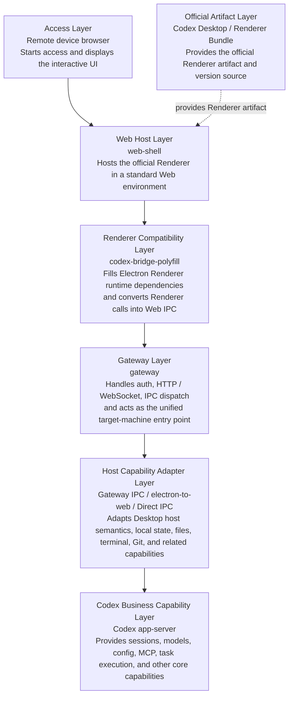

# OpenCodex

[中文](../README.md) | **English**

OpenCodex is a lightweight implementation of a Codex runtime environment. It runs the official Codex Renderer in a standard Web environment, allowing users to remotely access and operate Codex running on a target machine from any device and network.

In one line:

```text
browser -> web-shell -> official Codex renderer -> bridge polyfill -> gateway -> Codex app-server / local host capabilities
```

---

Bad timing: just as this project was about to be open sourced, ChatGPT App added Codex support.

OpenCodex still has several advantages compared with the official mobile path:

1. No proxy setup required.
2. No Google Play account required.
3. Full Codex feature support, including file tree, terminal, review, and other workflows that make AI coding practical anytime and anywhere.

> This software is currently a beta version and may still have issues. If you find a problem, please report it through an issue so the developer can fix it.

<p align="center">
  
  &nbsp;
  
  &nbsp;
  
  &nbsp;
  
</p>

## Core Components

The project has three main parts:

| Module | Purpose |
| --- | --- |
| `web-shell/` | Browser entry point for loading the official renderer and providing the renderer runtime environment. |
| `gateway/` | Local Node gateway that provides HTTP, WebSocket, IPC compatibility, local files, git, terminal, state sync, and app-server forwarding. |
| `/electron-to-web/` | Electron semantics adapter. The gateway prefers it by default to reuse Electron IPC behavior, with a self-implemented `DirectGatewayElectronIpcPort` as an alternative. |

This software **does not modify** Codex code. It only uses the corresponding Renderer artifacts.

When the Gateway starts, it automatically checks whether the local Codex installation has been updated. If an update is found, it automatically refreshes the Renderer artifacts used by OpenCodex, which means it follows the corresponding Codex version.

## Architecture Overview



Core principles:

- Reuse the official Renderer instead of rewriting the main UI.
- Keep browser-side code focused on host-environment compatibility.
- Let the gateway own local capabilities and app-server proxying, so remote browsers do not directly access local tokens or the app-server.
- Record uncovered Desktop IPC calls in `reports/unknown-ipc.jsonl` and bridge them incrementally.

## Requirements

- Node.js 20 or newer
- pnpm
- Codex Desktop installed locally, recommended, or explicit environment variables pointing to the Codex Desktop app or official bundle.
- macOS / Windows. Launcher build commands are provided for both macOS and Windows.
- Windows packaging requires Visual Studio 2022 C++ build tools and the Spectre-mitigated VC++ libraries for the target architecture. Otherwise, rebuilding the native `node-pty` module will fail.

Install dependencies:

Clone with submodules:

```bash
git clone --recursive xxx
```

```bash
pnpm install
```

## How To Use

### Desktop One-Click Launcher Package

A Launcher packaging entry point is currently available. On startup, it automatically starts the gateway and shows:

- Local access address, gateway process, and listening port.
- Current Codex version, build, Codex installation path, `app.asar` path, and CLI path.
- Config file, logs, reports, and official renderer cache directories.
- Current app-server connection status.
- Access password settings. Authentication is disabled when the password is empty.
- Startup address settings. Local mode listens on `127.0.0.1`; LAN mode listens on `0.0.0.0` and shows accessible LAN addresses.
- Port settings. On first startup, the Launcher randomly chooses an available port and persists it. You can manually set the port later.

After installing dependencies and building, you can debug the Launcher locally:

```bash
pnpm run desktop:dev
```

Build macOS installer artifacts:

```bash
pnpm run desktop:dist:mac
```

Build Windows installer artifacts:

```bash
pnpm run desktop:dist:win
```

Artifacts are written to `release/`. The Launcher listens on `127.0.0.1` by default, chooses a random available port on first startup, and stores runtime data in the system user data directory instead of the installation directory. After changing the listening address, port, or access password, the Launcher restarts the gateway so the configuration takes effect.

> Codex Desktop still needs to be installed locally before packaging. The Launcher reuses the official renderer and app-server capabilities from the local Codex Desktop installation.

#### Build A macOS Installer

Build macOS artifacts from a clean repository:

```bash
git clone --recursive xxx
cd OpenCodex
pnpm install
pnpm run build
pnpm run desktop:dist:mac
```

`desktop:dist:mac` first compiles `vendor/electron-to-web` and `gateway`, then uses `electron-builder` to generate `.dmg` and `.zip` artifacts. Outputs are written to `release/`:

```text
release/OpenCodex-<version>-arm64.dmg
release/OpenCodex-<version>-arm64-mac.zip
```

If you only need to verify the current local architecture, specify the architecture directly. For example, on Apple Silicon:

```bash
pnpm run build
pnpm exec electron-builder --mac dmg zip --arm64
```

Debug an unpacked `.app`:

```bash
pnpm run build
pnpm exec electron-builder --mac --dir --arm64
```

The generated `.app` creates a user data directory on startup and stores Launcher settings, access password configuration, gateway logs, and the official renderer cache there.

#### Build A Windows Installer

Build Windows artifacts from a clean repository:

```powershell
git clone --recursive xxx
cd OpenCodex
pnpm install
pnpm run build
pnpm run desktop:dist:win
```

`desktop:dist:win` first compiles `vendor/electron-to-web` and `gateway`, then uses `electron-builder` to generate an x64 NSIS installer and `.zip`. Outputs are written to `release/`.

Debug an unpacked Windows application directory:

```powershell
pnpm run build
pnpm run desktop:pack:win
```

### Command-Line Startup

Build first:

```bash
pnpm build
```

Start the service:

**Setting an access password is strongly recommended**. You can copy the example config and edit the password:

```bash
cp config.example.yaml config.yaml
```

You can also create `config.yaml` manually in the current working directory:

```yaml
auth:
  password: "your-password"
```

On the first startup, the gateway rewrites this field to `sha256-v1:<hash>` so the plaintext password is not kept in the config file. If `config.yaml` is missing, `auth.password` is missing, or the field is empty, password authentication stays disabled.
Only the block-style YAML form shown above is supported; inline forms such as `auth: { password: "..." }` are rejected.

```bash
HOST=0.0.0.0 PORT=3737 pnpm run web:dev
```

Health check:

```text
curl http://127.0.0.1:3737/api/health
```

Remote access:

Use Tailscale, ZeroTier, a company VPN, or a similar private network solution for secure **remote LAN** access. **Direct public exposure is not recommended**.

## Environment Variables

| Variable | Default | Description |
| --- | --- | --- |
| `HOST` | `0.0.0.0` | Gateway bind address. The default is intended for remote access. |
| `PORT` | `3737` | Gateway port. |
| `CODEX_WEB_AUTH_TOKEN_TTL_MS` | `43200000` | Gateway access token lifetime. The default is 12 hours. |
| `CODEX_WEB_DEBUG` | empty | Set to `1` or `true` for verbose debug logs. |
| `CODEX_WEB_SLOW_LOG_MS` | `750` | IPC slow-call logging threshold. |
| `CODEX_WEB_LOCAL_FILE_TOKEN_TTL_MS` | `300000` | Lifetime for local file preview URL tokens. |
| `CODEX_DESKTOP_APP_PATH` | auto scan | Explicit path to the Codex Desktop installation or its `app.asar`. |
| `CODEX_WEB_RUNTIME_DIR` | project directory | Gateway runtime directory. The Launcher sets this to the user data directory. |
| `CODEX_WEB_CONFIG_PATH` | `config.yaml` | Access password configuration file path. |
| `CODEX_WEB_REPORTS_DIR` | `reports` | Diagnostic reports directory. |
| `CODEX_WEB_OFFICIAL_BUNDLE_DIR` | `cache/codex-official-bundle` | Cache directory for extracted official webview assets. |
| `CODEX_WEB_IPC_IMPL` | `electron-to-web` | Set to `direct` to use the direct IPC fallback implementation. |

## Files / Directories

| Path | Description |
| --- | --- |
| `gateway/src/server.ts` | Gateway entry point. It wires HTTP, WebSocket, auth, official bundle loading, IPC, and app-server integration. |
| `gateway/src/codex-app-server.ts` | Codex app-server client for connection management, request forwarding, startup cache warmup, and health status. |
| `gateway/src/ipc/` | Gateway IPC abstractions and Electron/Codex compatibility implementations. |
| `gateway/src/official/` | Codex Desktop `app.asar` scanning, identification, caching, and webview extraction. |
| `web-shell/index.html` | Browser bootstrap shell for login, settings, and loading the patched official renderer. |
| `web-shell/codex-bridge-polyfill.js` | Browser-side Electron/Codex bridge polyfill. |
| `reports/unknown-ipc.jsonl` | Runtime log for unknown IPC calls. |

## pnpm Scripts

| Script | Description |
| --- | --- |
| `pnpm run build:gateway` | Compile `gateway/src` into `gateway/dist`. |
| `pnpm run web:dev` | Start the compiled gateway. |
| `pnpm run build:vendor` | Build `vendor/electron-to-web`. |
| `pnpm run test:vendor` | Run `vendor/electron-to-web` tests. |
| `pnpm run desktop:dev` | Compile and start the Launcher for debugging. |
| `pnpm run desktop:pack:mac` | Generate an unpacked macOS `.app`. |
| `pnpm run desktop:dist:mac` | Generate macOS `.dmg` and `.zip` artifacts. |
| `pnpm run desktop:pack:win` | Generate an unpacked Windows application directory. |
| `pnpm run desktop:dist:win` | Generate a Windows NSIS installer and `.zip` artifact. |

## Troubleshooting

### Chat history is empty after opening a session

The first load can be slow and is affected by remote LAN bandwidth. If the history is not visible at first, wait for a while and it should appear.

### The page does not open after startup

Check whether the gateway is listening:

```bash
curl http://127.0.0.1:3737/api/health
```

If the port is already in use, start on another port:

```bash
PORT=3738 pnpm run web:dev
```

### Codex Desktop official bundle is not found

Set the Codex Desktop path explicitly:

```bash
CODEX_DESKTOP_APP_PATH="/Applications/Codex.app" pnpm run web:dev
```

You can also choose the bundle cache directory:

```bash
CODEX_WEB_OFFICIAL_BUNDLE_DIR="./cache/official-bundle" pnpm run web:dev
```

### IPC behavior is incomplete

Inspect unknown IPC logs and report them to the developer:

```bash
tail -f reports/unknown-ipc.jsonl
```

### Links

[LinuxDo](https://linux.do/)
